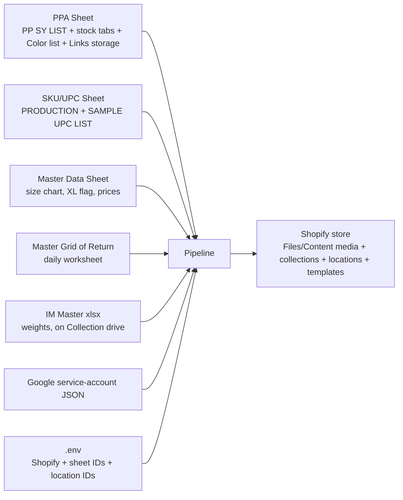

# PPA — Data Preparation Checklist

What must exist (and be filled in) so [main.py](main.py) (manual `data` list) and [return_product.py](return_product.py) (bulk from Master Grid of Return) can run cleanly.

Companion to [PPA_FLOW.md](PPA_FLOW.md) — that doc covers the *logic*, this one covers the *inputs*.

---

## 0. Dependency map at a glance



If any one of these is missing, mis-tabbed, or has wrong headers, **the affected step will usually fall back to empty values / `qty=0` / `barcode=""`** rather than failing loudly — behind a `try / except: traceback.print_exc()`. A few lookups (size chart, price) crash on `.iloc[0]` when their row is missing. Verify each input below before a run.

---

## 1. Credentials & environment

| File | Purpose | Required keys / contents |
|---|---|---|
| `Setup/.env` | All sheet IDs, Shopify credentials, location IDs | See table below |
| `credentials/dialy-report-automation-e20c53e67542.json` | Google service-account key used by `gspread` and `googleapiclient` | Standard service-account JSON. The account must be **shared as Editor** on every Google Sheet in §2. Loaded via a **relative path** in `Setup/setup.py`, so scripts must run from the project root. |
| `<season_code> IM MASTER.xlsx` | Per-size weights | Read from a **fixed Collection path** (see §3), not the project root. The current season's file must be synced locally. |

`.env`, `credentials/`, and `*.xlsx` are all gitignored.

### `.env` keys actually consumed by the code

| Key | Used by | Notes |
|---|---|---|
| `CLIENT_ID` | Shopify OAuth (via `set_sy`) | Custom-app credentials |
| `CLIENT_SECRET` | Shopify OAuth (via `set_sy`) | Custom-app credentials |
| `PPA_SHEET_ID` | `PUD.decide` (reads `PP SY LIST`), `ProductInfo` stock/Color/Links reads, `fetch_product_id_new.py` write. **NOTE:** the `main.py` / `return_product.py` PP SY LIST writebacks use the sheet ID as a **hardcoded string literal**, not this env var. | The "PPA sheet" with multiple tabs |
| `SKU_UPC_ID` | `ProductInfo.fetch_barcode`, `ProductInfo.get_sku_barcode`, `fetch_product_id_new.py` | The UPC sheet |
| `MASTER_DATA_ID` | `ProductInfo.get_metachart`, price lookups | Size chart + XL flag + prices |
| `RETURN_ID` | `return_product.py` (reads daily worksheet, writes link in column R) | Master Grid of Return |
| `NE_First_Choice_ID` | `set_inventory_metafield` for `fixed` / `sale_stock` (real NE qty) | Shopify location ID |
| `Bali_Stock_ID` | `set_inventory_metafield` for `fixed` / `sale_stock` (real Bali qty) | Shopify location ID |
| `NE_Sample_ID` | `set_inventory_metafield` for `sample` (qty from `get_sample_qty()`) | Shopify location ID |
| `Bali_To_Produce_ID` | `set_inventory_metafield` for `unfix` / `o4` (qty 5000 placeholder) | Shopify location ID |

Ten keys total. The Shopify access token must have scopes covering: products (read/write), inventory (read/write), publications (read/write), metafields/metaobjects (read/write), and **files (read)** — since `productSet` references existing Files/Content media by GID.

---

## 2. Google Sheets

### 2.1 PPA Sheet (`PPA_SHEET_ID`)

The primary sheet. Multiple tabs, all read by the pipeline.

#### 2.1.1 `PP SY LIST` — create vs update lookup + per-style description

- **Used by:** `PUD.decide` (read), `main.py` + `return_product.py` (write new rows after a successful create)
- **Header row:** row 1 (data starts row 2)
- **Required columns:**
  - `Style` — substring match against `STYLE` param (case-insensitive)
  - `Color` — substring match against `COLOR` param (case-insensitive)
  - `Product ID` — Shopify numeric ID; the create-side writes this after a successful create
  - `Page Status` — must contain `"DRAFT"` for the pipeline to act; anything else is skipped
  - `FP/DC` — exact match (`"FP"` or `"DC"`)
  - `Description` — free-text paragraph injected into the product's `descriptionHtml` as `<p>{description}</p>`. **Looked up by `Style` substring only** (Color and FP/DC ignored), and the **last** matching row wins (`df_desc["Description"].iloc[-1]`). So the description is effectively style-level, and if a style appears in multiple rows, the bottom-most one is used.
- **`main.py` and `return_product.py` write** new rows starting at column **A** of the first row where `Style` is empty: `[STYLE, COLOR, product_id, "DRAFT", FP_DC]`. Column order must match the sheet.
- ⚠️ **`Page Status` is a stale snapshot.** Only refreshed by running `fetch_product_id_new.py`. Between snapshots a Shopify product can drift DRAFT → ACTIVE without the sheet knowing.
- ⚠️ `PUD.decide` uses `str.contains` (substring + regex). Prefix-colliding styles can match the wrong row. Keep style names disambiguated.
- ⚠️ **Description editing workflow:** updates re-PUT `descriptionHtml`, so editing the description in the Shopify admin gets clobbered on the next `update_*` run. Edit the `Description` cell here instead.

#### 2.1.2 `NE STOCK` — NE warehouse stock + SKUs (per size)

- **Used by:** `ProductInfo.get_NE_qty` (returns `(qty, skus)` per size)
- **Required columns:**
  - `style` — substring filter against `self.style`
  - `color` — substring filter against `self.color` (**= first color only**)
  - `style_code` — used to build the SKU stem: `<style_code>-<color>` then `-<size>`
  - `X/S`, `S/M`, `M/L`, `X/L` — integer stock qty per size
- **Behavior:**
  - `qty_ne = [X/S, S/M, M/L, X/L]`, `skus = ["<stem>-X/S", …, "<stem>-X/L"]` where `stem = style_code + "-" + color` (from `.iloc[0]`).
  - No matching rows → `([0,0,0,0], ["","","",""])` (short-circuit; no crash).
- ⚠️ The SKU is **constructed from `style_code` + `color`**, not read from a SKU column. If `style_code` is mistyped or `color` differs from the UPC list's format, `fetch_barcode` won't match → empty barcode.

#### 2.1.3 `BALI STOCK` — Bali warehouse stock + SKUs

- **Used by:** `ProductInfo.get_BALI_qty` (returns `(qty, skus)` per size)
- **Same columns as `NE STOCK`**, but:
  - **`X/L` is hardcoded to 0** in the return — Bali doesn't carry X/L (by design)
  - Empty match → `([0,0,0,0], ["","","",""])`
- Used as a per-size fallback when `NE STOCK`'s SKU is blank for that size:
  ```python
  skus_chosen[i] = skus_ne[i] if str(skus_ne[i]).strip() else skus_ba[i]
  ```

#### 2.1.4 `NE SAMPLE STOCK` — sample inventory

- **Used by:** `ProductInfo.get_sample_qty`
- **Returns a scalar** — the `S/M` cell value (`df['S/M'].iloc[0]`), or `0` if no matching row.
- ✅ The callers (`create_sample` / `update_sample`) now pass this scalar **directly** to `product_post(qty=...)` and `set_inventory_metafield(qty_sample=...)` — the old `qty_sample[0]` slicing bug is **fixed**.

#### 2.1.5 `Color list` — brand color → generic color mapping

- **Used by:** `Setup/generic_color_generator.py`
- Brand color (e.g. `"Ventana Blue"`) → generic family (`"Blue"`, `"Pink"`, etc.) for SEO + tag generation.
- Color string is `/`-split first, so multi-color brand colors (`"Cream/White/Khaki"`) get one generic per piece.
- **Side-effect:** a missing brand color triggers a GPT proposal that **writes the new entry back to the sheet**. This is the only undocumented sheet write during a `create_*` / `update_*` call.

#### 2.1.6 `Links storage` — Shopify Files/Content media

- **Used by:** `ProductInfo.get_image_from_files` (the method actually used by create/update)
- **Required columns:** `Filename`, **`ID`** (the Shopify Files/Content **GID**), and `URL` (used only by the legacy `get_image` method)
- `get_image_from_files` derives a filename template from `STYLE` (abbreviations: `COTTON → CT`, `CREW → CR`, `CHUNKY → CH`, `LIGHTWEIGHT → LW`) and each color (slash → space, then space → dash), substring-matches `Filename`, **sorts by `Filename`**, and returns `{"id": <ID>, "alt": <color-slug>}` for each non-blank `ID`.
- If no rows match the abbreviated template, it retries with the raw style before giving up.
- Images are attached to the product by **GID reference** (`"file": {"id": gid}`), so Shopify reuses the existing Files/Content entry — no re-download, no duplicate in Content.
- ⚠️ **The `ID` column is now required.** Populate it by running [Setup/fetch_images_name_link.py](Setup/fetch_images_name_link.py), which lists Shopify Files (ID, URL, Filename, Alt) into this tab. A blank/missing `ID` → that image is silently dropped.
- ⚠️ A no-match returns an empty image list and prints a warning. The product is still created/updated — just with no images. On **update**, an empty `files` list is deliberately **not sent** (sending `files: []` would delete all existing media).

### 2.2 SKU / UPC Sheet (`SKU_UPC_ID`)

- **Used by:** `ProductInfo.get_sku_barcode` (default SKU + barcode), `ProductInfo.fetch_barcode` (lookup by SKU)
- **Two tabs:**
  - `PRODUCTION UPC LIST` — primary lookup for default barcodes and `fetch_barcode`
  - `SAMPLE UPC LIST` — used by `get_sku_barcode` when `sample=True`
- **Header row:** row 5 (data starts row 6) — `fetch_barcode` uses `values[5:]` with `columns=values[4]`.
- **Required columns:**
  - `Lineitem sku` — the SKU string (must match the SKU built in NE/BALI STOCK for `fetch_barcode`; comparison is case-insensitive after `.strip().upper()`)
  - `UPC Barcode` — the barcode posted to Shopify's variant `barcode` field
- ⚠️ If a SKU isn't in `PRODUCTION UPC LIST`, `fetch_barcode` returns `""` and the variant ships with no barcode. Shopify accepts this silently.

### 2.3 Master Data Sheet (`MASTER_DATA_ID`)

- **Used by:** `ProductInfo.get_metachart` (size chart HTML → `custom.size_chart_metafield`), `ProductInfo.get_price` (cascading price), `ProductInfo.get_tags` (XL + printed flags)
- **Worksheet name** = `self.season_code` (e.g. `"S26"` for `"26 Spring"`, `"F26"` for `"26 Fall"`)
- **Header rows:** 10, 11, 12 (forward-filled and joined as `"H1 | H2 | H3"`)
- **Required columns** (consulted, not exhaustive):
  - `FROM IM | DESCRIPTION`, `FROM IM | COLOR` — filter keys (substring)
  - `DEV | XL | (Y/N)` — toggles whether the size chart includes X/L and removes the `FILTERBY-X/L, L/XL, X/L,` tag chunk when `N`
  - `WEB | PRINTED | (Y/N)` — `Y` appends `hand printed, printed,` to tags
  - `… | UPDATED SIZE | … | Width` / `… | Length` per size — populate the size chart (with `ORIGINAL SIZE | …` as fallback)
  - Price columns: `IM PRICE`, `LATEST FULL PRICE`, `PB ADJUSTED FULL PRICE`, `LATEST SALE PRICE`, `PB ADJUSTED SALE PRICE`
- The size chart **always renders the master-data sizes**, not the filtered keep-sizes, by design.
- ⚠️ A missing `(DESCRIPTION, COLOR)` row crashes `get_metachart` / `get_price` at `.iloc[0]` (caught by the outer try/except, but the product won't be built).

### 2.4 Master Grid of Return (`RETURN_ID`)

- **Used by:** `return_product.py` (read daily worksheet, write link to column R)
- **Worksheet name:** today's date `"%B %d, %Y"` (e.g. `"June 05, 2026"`) via `date.today().strftime(...)`. ⚠️ Currently **hardcoded** (`'Jun 5, 2026'`) with the dynamic line commented out — re-enable for scheduled runs, and note `strftime("%b %d, %Y")` vs `"%B %d, %Y"` must match the actual tab name.
- **Header row:** row 6 (data starts row 7); `dfs = pd.DataFrame(values[6:], columns=values[5])`
- **Required columns:**
  - `Style`, `Color` — passed to `PUD.decide` (and wrapped as `COLORS = [color]`)
  - `Added to full price`, `Added to sale` — `"x"` (case-insensitive) decides FP vs DC:
    - FP marked, DC blank → `FP_DC="FP"`, `SALE=False` → `create_fixed()` / `update_fixed()`
    - DC marked, FP blank → `FP_DC="DC"`, `SALE=True` → `create_sale_stock()` / `update_sale_stock()`
    - Both `x` → log + skip; Neither → log + skip
  - Any column with `"ZZ"` in its header — rows where any such column equals `"ZZ"` are dropped. After ZZ filtering, rows are deduped by `(Style, Color)`.
  - **Column R** — the destination cell for each row's Shopify admin link after a successful create or update.
- ⚠️ The Master Grid can have **duplicate column headers**; `return_product.py` uses a `_first()` helper (`x.iloc[0]` if Series, else `x`). Don't remove it.
- ⚠️ Column `R` is hardcoded. Verify it's the link column before a run.
- ⚠️ **Create branch is broken** (missing `DESCRIPTION` arg — see [PPA_FLOW §12](PPA_FLOW.md#12-known-gaps--open-items)). Only the update path works until patched.

---

## 3. IM Master workbook (`<season_code> IM MASTER.xlsx`)

- **Used by:** `ProductInfo.get_weight` (per-variant weight)
- **Location:** a **fixed Collection path**, set in `ProductInfo.__init__`:
  ```
  /Users/woodenship/Library/CloudStorage/GoogleDrive-web@pt-infashion.com/Shared drives/PTIF SERVER/Collection/<season>/IM/<season_code> IM MASTER.xlsx
  ```
  e.g. `…/Collection/26 Spring/IM/S26 IM MASTER.xlsx`. (The older `Copy of <season_code> IM MASTER.xlsx` in the project root is commented out.)
- **Header row:** `config/varia.py` → `IM_header` (pandas `header=`)
- **Required columns:**
  - `DESCRIPTION` — substring filter against STYLE; also must contain the size code (`S/M`, `M/L`, …) for the per-size weight. For `sample=True` runs, only rows containing `S/M` are kept.
  - `WS TAG COLOR` — color filter. **Note:** `get_weight` filters on the **first** matching row's `WS TAG COLOR` value (`df["WS TAG COLOR"].iloc[0]`), on the premise that every color shares the same per-size weight. If that premise breaks, weights will be wrong.
  - `PRE COMPONENT WT (PC WT)` — weight in **kg** (× 1000 → grams for Shopify)
- ⚠️ Read via `pd.read_excel(self.IM_path)`. If the Collection file isn't synced locally, the read raises `FileNotFoundError` (logged by the try/except), and weights fall back to `0` per size downstream.
- ⚠️ Per-season filename + folder. `26 Spring` → `…/Collection/26 Spring/IM/S26 IM MASTER.xlsx`; `26 Fall` → `…/Collection/26 Fall/IM/F26 IM MASTER.xlsx`. Confirm the file exists before a run.

---

## 4. Shopify-side prerequisites

Configured **inside the Shopify store**, not in a file.

### 4.1 Inventory location IDs

All four must exist and their numeric IDs set in `.env`:

| Env var | Used by (create-side) | Update-side behavior |
|---|---|---|
| `NE_First_Choice_ID` | `fixed` + `sale_stock` (NE qty) | Always written. Zeroed for `unfix`/`sample`/`o4`. |
| `Bali_Stock_ID` | `fixed` + `sale_stock` (Bali qty) | Always written. Zeroed for `unfix`/`sample`/`o4`. |
| `NE_Sample_ID` | `sample` (`get_sample_qty()` value) | Always written. Zeroed for non-`sample` types. |
| `Bali_To_Produce_ID` | `unfix` + `o4` (qty 5000 placeholder) | Always written. Zeroed for `fixed`/`sale_stock`/`sample`. |

Inventory is posted per variant via `POST 2026-01/inventory_levels/set.json` keyed by `inventory_item_id`. Verify each location resolves: `GET /admin/api/2026-01/locations.json`.

> **Create/update divergence:** `CreatePP.set_inventory_metafield` posts only to the relevant location(s); `UpdatePP.set_inventory_metafield` posts to all four and zeros the irrelevant ones — an intentional reset on update. See [PPA_FLOW §7](PPA_FLOW.md).

### 4.2 Shopify Files / Content media

- `productSet` attaches images by their existing Files/Content **GID** (the `ID` column in `Links storage`).
- The images must already be uploaded to Shopify Files. Populate `Links storage` (incl. the `ID` column) by running [Setup/fetch_images_name_link.py](Setup/fetch_images_name_link.py).
- Because attachment is by GID reference, no new Content entries are created and no re-download happens on update.

### 4.3 Theme templates

The active theme must publish the product templates referenced by `templateSuffix`:

- `default` — full-price products (fallback when `SALE=False`)
- `sale-item` — sale products (fallback when `SALE=True`)
- `nearly-gone` — when `tg.additional_tags` detects a low-qty band

`tg.additional_tags` returns a suggested `templateSuffix`; if `None`, the fallback is `'sale-item' if self.sale else 'default'`. If a referenced template doesn't exist, Shopify accepts the product but renders with the default template.

### 4.4 Publication channels

`set_sy.publish_to_all_channels(product_id, sale=...)` (create only):

- `sale=False` → publish to **every** channel from `publications(first: 20)`.
- `sale=True` → publish to every channel **except Pinterest**.

Caller usage:
- `create_unfix` / `create_fixed` → explicitly `sale=False` (Pinterest included)
- `create_sample` / `create_sale_stock` / `create_o4` → default `sale=True` (Pinterest excluded)
- Update methods do **not** call `publish_to_all_channels` — publish state from the original create stays.

### 4.5 Tax code metafield

- Namespace `avalara`, key `taxcode`, value `PC040100`.
- Set at the product level (in the productSet input) and per-variant (after creation, in `set_inventory_metafield`, on both create and update).
- No prerequisite definition needed — Shopify auto-creates on first write.
- ⚠️ Every update re-POSTs the per-variant metafield. Shopify usually dedupes by `(owner_id, namespace, key)`; if duplicates appear, switch to GraphQL `metafieldsSet`.

### 4.6 Size chart metafield

- Namespace `custom`, key `size_chart_metafield`, value = the HTML from `get_metachart()`.
- Set at the product level in the productSet input (it is **no longer embedded in `body_html`/`descriptionHtml`**).
- The theme must read `custom.size_chart_metafield` to render the chart.

---

## 5. Per-row data quality rules

For one row (Master Grid or a `main.py` entry) to produce a clean result, **every dependent lookup must hit a matching row**.

| Lookup | Match keys | Sheet/file | Failure mode |
|---|---|---|---|
| Decide create vs update | `Style` substring, `Color` substring, `FP/DC` exact | `PPA_SHEET_ID` → `PP SY LIST` | No row → `create_new=True, status="DRAFT"` → create branch |
| Per-style description | `Style` substring (no Color/FP_DC), **last** match | `PPA_SHEET_ID` → `PP SY LIST` | No row → `description = ""` |
| NE qty + SKU | `style` substring, `color` substring (first color) | `PPA_SHEET_ID` → `NE STOCK` | Empty → `([0,0,0,0], ["","","",""])` |
| Bali qty + SKU | `style` substring, `color` substring | `PPA_SHEET_ID` → `BALI STOCK` | Empty → `([0,0,0,0], ["","","",""])`; with NE empty → `keep=[]` → "No stock" skip |
| Sample qty | `style` substring, `color` substring | `PPA_SHEET_ID` → `NE SAMPLE STOCK` | Empty → `0` (scalar) |
| Barcode by SKU | Exact normalized SKU | `SKU_UPC_ID` → `PRODUCTION UPC LIST` | Missing → barcode = `""` |
| Default SKU + barcode (unfix/sample/o4) | Style+Color filter | `SKU_UPC_ID` → `PRODUCTION`/`SAMPLE UPC LIST` | Missing → variant gets empty SKU/barcode |
| Size chart + XL/printed + prices | `FROM IM \| DESCRIPTION` substring, `FROM IM \| COLOR` substring | `MASTER_DATA_ID` → `<season_code>` tab | Empty → crashes at `.iloc[0]` |
| Generic color | Per-`/`-separated color piece | `PPA_SHEET_ID` → `Color list` | Missing → GPT proposes + writes back |
| Weight | STYLE + (first-row) WS TAG COLOR + size code | IM Master xlsx (Collection path) | Missing/unsynced → weights fall back to `0` |
| Images | Filename substring (abbreviated; raw retry), needs `ID` | `PPA_SHEET_ID` → `Links storage` | Missing/blank `ID` → empty images, warning printed |

**Pre-run rule of thumb:** for each row, confirm the `(STYLE, COLOR)` pair appears in:

1. `NE STOCK` and/or `BALI STOCK` (at least one non-zero for fixed / sale_stock)
2. `PRODUCTION UPC LIST` with a non-empty `UPC Barcode` for every NE SKU you expect to ship
3. `MASTER_DATA_ID` (required — size chart / price lookups crash without it)
4. `Color list` (or accept GPT will write a new entry)
5. IM Master xlsx (for weights — and the Collection file is synced locally)
6. `Links storage` with a populated `ID` column (for images)
7. `PP SY LIST` if you want an update; absent → create. Fill the `Description` cell if you want a body paragraph.

---

## 6. Per-season tweaks (what changes when starting `S27`, `F26`, …)

| Where | What | Action |
|---|---|---|
| `main.py` | `SEASON = "26 Spring"` constant | Update to new season string |
| `return_product.py` | `SEASON = "26 Spring"` (hardcoded inside the loop) | Update to new season string |
| Collection drive | `…/Collection/<season>/IM/<season_code> IM MASTER.xlsx` | Ensure the new season's IM Master file exists and is synced locally |
| `config/varia.py` | `IM_header`, `season` | Confirm the header row didn't shift; `season` is informational |
| `MASTER_DATA_ID` | New worksheet matching the new `season_code` (`S27`, `F26`, …) | Populate size chart cells + prices for every style+color |
| `PPA_SHEET_ID` → `NE STOCK` / `BALI STOCK` | New season rows + stock counts | Updated by stock team |
| `PPA_SHEET_ID` → `NE SAMPLE STOCK` | New season sample rows | Updated by stock team |
| `PPA_SHEET_ID` → `Color list` | New colors | Add manually or let GPT write them on first reference |
| `PPA_SHEET_ID` → `Links storage` | New season image filenames + **IDs** + URLs | Run `fetch_images_name_link.py`; required for images |
| `SKU_UPC_ID` → `PRODUCTION UPC LIST` | New SKUs + barcodes | Critical — empty `UPC Barcode` = empty barcodes on Shopify |
| `RETURN_ID` | A daily worksheet matching the configured name | Ops creates the daily tab; re-enable the dynamic `date.today()` line |

There's no single `SeasonConfig` object yet — these are scattered. A consolidation would be a useful refactor.

---

## 7. Naming-convention contracts (parser depends on these)

`ProductInfo` parses substrings from `STYLE` and `COLOR` to derive product type, tags, fabric category, etc.

### STYLE string — what `get_type()` looks for

Resolves Shopify `productType` via a first-match cascade (substrings of the uppercase style):

| Substring | `productType` |
|---|---|
| `" V "` (space-bracketed) | `V-neck` |
| `CREW` | `Crewneck` |
| `CARDI` | `Cardigan` |
| `" T "` (space-bracketed) | `T-neck` |
| `" COLLAR "` (space-bracketed) | `Collar` |
| (none of the above) | `""` (empty) |

### STYLE string — what tag/composition logic looks for

`ProductInfo.title_and_desc` and `Setup/tags_generator.generate_tags`:

- **Composition branch:** last token of `STYLE.split(" ")` — `COTTON` or `MERCER` → `60% cotton, 40% acrylic`; anything else → `76% acrylic, 12% Mohair and 12% Wool`.
- **Tag triggers** (substring tests on uppercase STYLE): `COTTON`, `MERCER`, `CHUNKY` (else `lightweight`), `TEE`, `3/4`, `HALF SLEEVE` (else long sleeve default), `HOODIE`, `ZIP`, `CARDIGAN`/`CARDI`, `STRIPED`, `PRINTED`, `MARLED`/`HEATHERED`, `POCKET`, `CABLE`, `V`, `CREW`, `COLLAR`.

### COLOR — now a list (`COLORS`)

- `main.py` / `return_product.py` pass a **list** of colors; `self.color = colors[0]`, `self.colors = colors`.
- Multi-color brand colors are slash-separated; `Color list` lookup runs per-piece (`"Cream/White/Khaki"` → 3 generic-color lookups).
- Substring `MULTI` in color → adds `Multi,` to tags.
- Special generic-color expansions: `Purple → Purple, Violet`; `White`/`Black`/`Grey`/`Brown` → adds `Neutral`; `Grey → Grey, Gray`; `Brown → Brown, Chocolate, Tan, Cream, Nude`.
- ⚠️ Stock + sample lookups use **`colors[0]` only**; additional colors reuse the first color's stock/keep.

### FP_DC mapping (driven by production_type or sheet column)

| production_type | FP_DC | SALE |
|---|---|---|
| `unfix`, `fixed` | `FP` | `False` |
| `sale_stock`, `sample`, `o4` | `DC` | `True` |

---

## 8. Pre-flight checklist

Before running:

- [ ] `Setup/.env` has all 10 keys from §1
- [ ] `credentials/dialy-report-automation-e20c53e67542.json` is present and the service account is shared as Editor on the PPA, SKU/UPC, Master Data, and Master Grid sheets
- [ ] Running from the **project root** (relative `credentials/` path)
- [ ] `numpy<2` is installed (pandas import otherwise fails)
- [ ] The IM Master file exists at the Collection path for the season and is synced locally
- [ ] `(STYLE, COLOR)` appears in `NE STOCK` or `BALI STOCK` (for fixed/sale_stock)
- [ ] Every NE SKU expected to ship has a `PRODUCTION UPC LIST` row with non-empty `UPC Barcode`
- [ ] Brand color is in `Color list` (or you accept a GPT write-back)
- [ ] `MASTER_DATA_ID` has a row for `(STYLE, COLOR)` with size chart cells populated (else `get_metachart`/`get_price` crash)
- [ ] `Links storage` has rows whose `Filename` matches the style+color template **and** a populated `ID` column (run `fetch_images_name_link.py`)
- [ ] All 4 Shopify location IDs in `.env` resolve (`GET /locations.json`)
- [ ] Active theme has the `default`, `sale-item`, and `nearly-gone` templates and reads `custom.size_chart_metafield`
- [ ] `PP SY LIST.Description` cell is populated for the style (or you accept an empty `<p></p>`)
- [ ] (Bulk) Master Grid has the daily worksheet matching the configured `worksheet_name`
- [ ] (Bulk) Column `R` on that worksheet is the link/result column
- [ ] (Bulk) `return_product.py`'s create branch has been patched to pass `DESCRIPTION` into `CreatePP(...)` — currently missing it (see [PPA_FLOW §12](PPA_FLOW.md#12-known-gaps--open-items))

If all checks pass, the pipeline should run cleanly.
