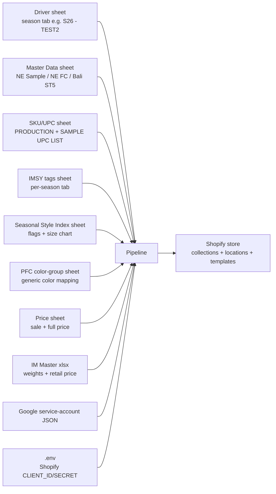

# PPA — Data Preparation Checklist

What must exist (and be filled in) so the pipeline can run **fully unattended** for one season.

Companion to [PPA_FLOW.md](PPA_FLOW.md) — that doc covers the *logic*, this one covers the *inputs*.

---

## 0. Dependency map at a glance

If any one of these is missing, mis-tabbed, or has wrong headers, the affected branch will silently fall back to empty values / `price=0` / `weight=0` / `tags=None`. The pipeline doesn't fail loudly — **it fails quietly with bad data**. Verify each input below before a season run.

---

## 1. Credentials & environment

| File | Purpose | Required keys / contents |
|---|---|---|
| `.env` | Shopify OAuth credentials | `CLIENT_ID`, `CLIENT_SECRET`, `SPREADSHEET_ID` |
| `credentials/dialy-report-automation-e20c53e67542.json` | Google service-account JSON used by `gspread` | Standard service-account JSON. The account must be **shared as Editor** on every Google Sheet listed in §2. |

Shopify scopes the access token must have: `read_products`, `write_products`, `read_inventory`, `write_inventory`, `read_publications`, `write_publications`, `read_metaobjects`, `write_metaobjects` (because the script POSTs products, sets inventory levels, posts variant metafields, and runs the `publishablePublish` GraphQL mutation).

---

## 2. Google Sheets (7 sheets)

> All sheet IDs are currently hardcoded inside `all_function_list_underdev.py`. A rewrite should move these to a single config block, ideally `.env`.

### 2.1 Driver sheet — the season tab (the "run list")
- **Sheet ID:** `1CX6tjxos0N2p_YRmrgo6sA7KSPM5bZnBdyaQZuJWoCk` (from `.env` `SPREADSHEET_ID`)
- **Tab:** named after the run, e.g. `S26 - TEST2` (passed into `bulk_produce(...)`)
- **One row per product+color to publish.**
- **Required columns** (consumed by `bulk_produce` / `main_underdev`):
  - `STYLE` — product name as it appears in master data (e.g. `BERLINI POLO TOP CT`)
  - `COLOR` — color string, may be slash-separated for multi-color (e.g. `NAVY/IVORY`)
  - `COLLECTION` — one of: `ESSENTIALS`, `BLOSSOM`, `SAS`, `LAKE`, `BEACH`, `BEACH & LAKE`, `AMERICANA`, `TRANSITION` (case-insensitive; anything else → no collection-release tag)
  - production-type column (returned as `production_types` from `bulk_produce`), values must be **exactly one of**: `sale sample`, `unfixed inv`, `sale O4`, `sale stock`, `fixed stock`, `fixed inv`
  - `ACTION` — written back as `PP CREATED` on success
  - `CHECK` — written back with hyperlink to the created Shopify admin URL on success
- **Skip logic:** `bulk_produce` is in [pp_status.py](pp_status.py) — currently not present in this folder. The skip/already-processed filter lives there; confirm it doesn't re-process rows already marked `PP CREATED`.

### 2.2 Master Data sheet (NE / Bali stock counts)
- **Sheet ID:** `1u-Nk4CSmBjSFtopVXIsssVPsw9YRZJb2woHP9YLW3j0`
- **Three tabs** (all must exist; read by `Product._master_data`):
  - `STOCK NE SAMPLE` — used by `ne_sample()`
  - `STOCK NE FIRST CHOICE` — used by `ne_first_choice()`
  - `STOCK BALI ST5` — used by `bali_stocks()`
- **Header row:** row 1 (data starts row 2)
- **Required columns (all tabs):** `STYLE`, `COLOR`, `SKU`
- **NE SAMPLE tab extra column:** `STOCK NE SAMPLE` (integer stock qty)
- **NE FIRST CHOICE & BALI ST5 extra columns:** `X/S`, `S/M`, `M/L`, `X/L` — integer stock qty per size; **`"0"` is treated as "size not stocked"** and the size is dropped from the variant set
- ⚠️ The current `bali_stocks()` has the `X/L` block commented out — Bali never contributes X/L. Decide if that's intended before season run.
- ⚠️ Stock values are read as strings (`!= "0"`) — empty cells, formulas returning `0` (int), or `"0.0"` will behave inconsistently. Keep cells as plain integer-formatted text.

### 2.3 SKU / UPC sheet (barcodes + unfixed-inventory size list)
- **Sheet ID:** `1k-gCMaXqDtzROFUbIX3DFnA_MpzK__8eDDWlkRLhnCc`
- **Two tabs:**
  - `PRODUCTION UPC LIST` — used by `unfix()` (header row 6 / data row 7+) and by `get_barcodes(sample=False)`
  - `SAMPLE UPC LIST` — used by `get_barcodes(sample=True)` (header row 5 / data row 6+)
- **Required columns:** `Product Name`, `Lineitem sku`, `UPC Barcode`
- **SKU format expectation:** `<code>-<color>-<size>` where size is the last `-` segment (`X/S`, `S/M`, `M/L`, `X/L`). If the SKU is malformed the size sort/merge breaks silently.
- **Barcodes must be populated for every SKU you intend to publish.** If a barcode is missing for any SKU in a multi-size product, the whole product falls back to `[0,0,0,0]` and ships with empty barcodes.

### 2.4 IMSY sheet (pre-built tags string)
- **Sheet ID:** `1W5JJiunUbEZVv-vxUfEXgdVxw4wvrjayXwRz2VIkIQY`
- **Tab:** named exactly as the `season` parameter (e.g. `S26`)
- **Range read:** `A:CW` (header row 5, data row 6+)
- **Required columns:** `DESCRIPTION`, `COLOR`, `ALL SUMMARY FOR CSV`
- The `ALL SUMMARY FOR CSV` column is the **preformatted comma-separated tag string** for the product. If a product+color has no row here, `tags=None` and the pipeline falls back entirely to the design/keyword tag generator (the "additional_tags" block). That fallback is incomplete — missing IMSY rows = noticeably weaker SEO tags.

### 2.5 Seasonal Style Index sheet ("SSI" — size chart + design flags)
- **Sheet ID:** `1esbj3SiVjMGgdoBCnV75z3UircVUXj_gUR64BPpRPgU`
- **Tab:** worksheet **index 6** (the 7th tab) — used by both `get_tags()` and `get_meta_chart()`
- **Headers are 3 stacked rows (3, 4, 5)** forward-filled and joined with ` | `
- **Required columns:**
  - `FROM IM | DESCRIPTION`, `FROM IM | COLOR` (lookup keys)
  - `DEV | GRADED (incl XL if XL is applicable) | (Y/N)` — controls whether size chart has 3 rows or 4
  - `WEB | PRINTED | (Y/N)`, `WEB | BOYFRIEND | (Y/N)`, `WEB | UPDATED | CROPPED (Y/N)`, `WEB | ORIGINAL | CROPPED (Y/N)`
  - All `... | UPDATED SIZE (CM) | ... | Width` and `... | Length` columns (per size: X/S, S/M, M/L, X/L)
  - All `... | ORIGINAL SIZE | ... | Width` and `... | Length` columns (fallback when UPDATED is empty)
- **If the row exists but Width/Length cells are blank for a size**, the size chart renders that row as `-` — which is visible to the customer. Fill these in before publishing.
- ⚠️ The "tab index 6" is fragile — if anyone reorders tabs in this sheet, the script silently reads the wrong tab. Pin by name in the rewrite.

### 2.6 PFC color-group sheet (generic color name mapping)
- **Sheet ID:** `1foCvn9twfZ-ucvL0LDoQFv-Yor2fDxxxGXMLxS7XQCc`
- **Two tabs used (current code):**
  - `S25 - COLOR GROUP` — used when season starts with `S` (range `A:E`, header row 5)
    - Required columns: `S25 COLORS`, `COLOR CATEGORY 1`
  - `F24 - COLOR GROUP` — used when season starts with `F`, or as fallback when an S color isn't found (range `A:C`, header row 1)
    - Required columns: `F24 COLOR`, `COLOR CATEGORY 1`
- Maps raw color names (e.g. `"NAVY"`, `"DUSTY ROSE"`) to a generic family (`"Blue"`, `"Pink"`) used in SEO title/desc and color tags.
- ⚠️ Current code hardcodes `S25` and `F24` tab names regardless of the actual season. **For S26 you should either rename the tab or update the code** — otherwise S26 colors will only resolve if they happen to match a S25 entry.

### 2.7 Price sheet (sale price + compare-at price)
- **Sheet ID:** `16GWane0VWG5Usuk9iXk8-_DzPcCOsRHfi_eMnyupUao`
- **Tab:** `2026 - BEACH & LAKE` (hardcoded — must be changed for other collections/seasons)
- **Header row:** row 11 (data row 12+)
- **Required columns:**
  - `STYLE`, `COLOR` (lookup keys, exact match casefold)
  - `PB ADJUSTED SALE PRICE ON FEB 26` — primary sale price
  - `LATEST SALE PRICE` — fallback if PB adjusted is empty or `N/A`
  - `PB ADJUSTED FULL PRICE` — primary compare-at price
  - `LATEST FULL PRICE` — fallback if PB adjusted is empty
- Prices may include `$` and `,` — those are stripped. Empty / `N/A` → product gets price `0` and is created in draft.
- ⚠️ Lookup uses **exact** STYLE+COLOR match (casefold), unlike most other sheets that use substring `str.contains`. Watch for whitespace / trailing characters.

### 2.8 *(Currently unused at read-time but referenced)*: `Yarn_Warehouse_ID`, `Jillamy_WBPA_ID`
- Defined as Shopify location IDs in `create_product_underdev.py` but no current code path writes inventory to them. Safe to leave; flag if a new branch needs them.

---

## 3. Local Excel files (IM Master — weights & retail price)

The script reads from a Google-Drive-synced local folder under `/Users/ptinfashion/...`. **The user account running the script must have these files synced locally.**

| File | Used by | Header row | Required columns |
|---|---|---|---|
| `…/PTIF SERVER/Collection/26 SPRING/IM/S26 IM MASTER.xlsx` | `get_weight()`, `get_weight_multiple()`, `get_fullprice()` | 56 | `DESCRIPTION`, `WS TAG COLOR`, `PRE COMPONENT WT (PC WT)`, `FINAL RETAIL PRICE` |
| `…/PTIF SERVER/Collection/25 FALL/IM/F25 IM MASTER.xlsx` | fallback when S26 lookup is empty | 56 or 60 | Same as above, plus a multi-line `WS TAG COLOR\n(Note - Tag color untuk style striped hanya STRIPE tanpa D)` variant |

Notes:
- Weight column is in **kg**, the script multiplies by 1000 → grams.
- `DESCRIPTION` rows must contain the size code (`S/M`, `M/L`, …) so the per-size weight lookup works.
- ⚠️ Path is hardcoded to the `ptinfashion` user. Running as a different user (e.g. `woodenship`) breaks `get_weight*` and `get_fullprice` silently — they return `None` / `0`. The rewrite should resolve paths relative to a configurable Drive root.

---

## 4. Shopify-side prerequisites

These are configured **inside the Shopify store**, not in a file. They must exist before the first run.

### 4.1 Inventory locations (IDs hardcoded in `create_product_underdev.py`)
| Constant | ID | Used by |
|---|---|---|
| `Bali_Stock_ID` | `35472048176` | `create_fixed` (sale stock + fixed stock) |
| `Bali_To_Produce_ID` | `37977930` | `create_unfix` (qty 5000) |
| `Jillamy_WBPA_ID` | `14627995696` | (unused currently) |
| `NE_First_Choice_ID` | `65178107952` | `create_fixed` (sale stock + fixed stock) |
| `NE_Sample_ID` | `65218150448` | `create_sale_sample`, `create_04` |
| `Yarn_Warehouse_ID` | `36831821872` | (unused currently) |

Verify each ID still exists in the store: `GET /admin/api/2026-01/locations.json`.

### 4.2 Collections (titles must exist in store)
`set_sy.collection_release` does collection-add by *looking up custom collections by title*. The following titles **must exist** as custom collections in Shopify:
- `tax:clothing` (added to every product)
- `BEACH + LAKE` (when row's COLLECTION is `LAKE`, `BEACH`, or `BEACH & LAKE` — note the `+` vs `&`)
- *(Other COLLECTION values aren't currently mapped to a Shopify collection — only the tag is set.)*

⚠️ Read carefully: `collection_release` only assigns to `BEACH + LAKE` and `tax:clothing`. Despite the per-collection tag logic in `get_tags()`, **other collection names (ESSENTIALS, BLOSSOM, AMERICANA, SAS) do NOT get an automatic Shopify-collection assignment**. If you want auto-assignment, extend `collection_release` first.

### 4.3 Theme templates
The theme must publish two product templates:
- `default` (used for `fixed stock` / `fixed inv` / `unfixed inv`)
- `sale-item` (used for `sale sample`, `sale O4`, `sale stock`)

If `sale-item` doesn't exist in the live theme, Shopify will accept the product but fall back to default rendering — meaning sale items won't render with sale styling.

### 4.4 Publication channels
`publish_to_all_channels` queries `publications(first: 20)` and publishes to every one returned. **All channels active in the store get the new product.** If you want some channels excluded, edit the GraphQL filter — don't try to suppress them after the fact.

### 4.5 Tax code metafield
- Namespace: `avalara`, key: `taxcode`, value: `PC040100`
- Set at both the product level and per-variant level
- No prerequisite definition needed (Shopify auto-creates the metafield on first write)

---

## 5. Per-row data quality rules

For one row in the driver sheet to produce a clean published product, **every dependent lookup must hit a matching row**. Lookups use **case-insensitive `str.contains`** unless noted.

| Lookup | Match keys | Sheet/file | Failure mode |
|---|---|---|---|
| Master stock | `STYLE` contains row STYLE, `COLOR` contains row COLOR | Master Data tabs | `filtered.empty` → branch returns `None` → no variants from that source |
| Unfix sizes/barcodes | `Product Name` contains STYLE, `Lineitem sku` contains COLOR | UPC PRODUCTION | `filtered.empty` → branch returns `None` → product has no variants |
| Sample barcodes | `Lineitem sku` contains SKU | UPC SAMPLE | Exception → all barcodes set to `[0,0,0,0]` |
| IMSY tags | `DESCRIPTION` contains STYLE, `COLOR` contains COLOR | IMSY (season tab) | `tags=None` → fallback to weaker keyword tags |
| SSI flags + size chart | `FROM IM | DESCRIPTION` contains STYLE, `FROM IM | COLOR` contains COLOR | SSI (tab index 6) | `filtered.empty` → no design-flag tags, `metafield=" "` (empty size chart) |
| PFC generic color | `S25 COLORS` / `F24 COLOR` **exact casefold equals** color1 (and color2, color3 split by `/`) | PFC | Falls back to F24 tab; if still empty, `get_seo` returns `None` (whole product skipped) |
| Price (sale) | `STYLE` **exact casefold equals** STYLE, `COLOR` **exact casefold equals** COLOR | Price sheet | Empty → price=0, compare_at=0 (product created in draft with $0) |
| Full price | `DESCRIPTION` contains STYLE, `WS TAG COLOR` contains COLOR | IM Master xlsx | Empty → price=0 |
| Weight | Same as full price, plus `DESCRIPTION` contains size code | IM Master xlsx | Empty → weight=0 per missing size, `old_product=True` flag set |

**Practical rule of thumb:** for each row in the driver sheet, before you press play, confirm the (STYLE, COLOR) pair appears in:
1. Master Data (whichever stock tab applies to your `ptype`),
2. UPC PRODUCTION / SAMPLE,
3. IMSY (season tab),
4. SSI (tab index 6),
5. PFC color group (S/F tab matching season letter),
6. Price sheet *(only if `ptype` is a sale type)*,
7. IM Master xlsx for the season.

A simple pre-flight script that checks all 7 lookups and produces a "missing data" report per row would prevent ~all silent-bad-data failures.

---

## 6. Per-season tweaks (what changes when starting `S27`, `F26`, …)

Today these are scattered as hardcoded literals. List them so a season-start checklist is possible:

| Where | What | New value for next season |
|---|---|---|
| `main_underdev.py` | `season = "S26"` | Update season code |
| `main_underdev.py` | `bulk_produce("S26 - TEST2")` | Update driver tab name |
| `all_function_list_underdev.py` `_master_data(...)` | Tabs `STOCK NE SAMPLE` etc. are season-agnostic (presumably) | Verify still correct |
| `all_function_list_underdev.py` `get_tags()` | `IMSY` `worksheet_name=self.season` | Auto-resolves — good ✅ |
| `all_function_list_underdev.py` `get_tags()` & `get_seo()` | PFC tab `S25 - COLOR GROUP` / `F24 - COLOR GROUP` hardcoded | Should derive from `self.season` |
| `all_function_list_underdev.py` `get_weight*` / `get_fullprice` | IM Master path `26 SPRING/S26 IM MASTER.xlsx` | Update path or derive from `self.season` |
| `all_function_list_underdev.py` `get_price()` | Price tab `2026 - BEACH & LAKE` | Update tab name |
| `all_function_list_underdev.py` `get_tags()` | Collection release tags: `ESS 2026 release`, `BLSSM 2026 release`, `BCHLK release 2026`, `MRCN 2026` | Update year strings |
| `all_function_list_underdev.py` `get_tags()` | `BOGO 50% OFF, SAS FEB 2026,` | Update SAS sale label |
| `set_sy.collection_release` | Hardcoded `BEACH + LAKE` mapping | Confirm collection still exists in new season |

The rewrite should turn each of these into a single `SeasonConfig` object so a new season is a 1-place change.

---

## 7. Naming-convention contracts (parser depends on these)

The `Product` class parses substrings from `STYLE` and `COLOR` strings to make decisions. Anyone naming new styles must respect these conventions or the parser silently misclassifies.

### STYLE string (split on space, last-token-first analysis)
- Last token determines **product type**: `V` → V-neck, `CREW` → Crewneck, `CARDI` / `CARDIGAN` → Cardigan, `HOODIE` → Hoodie, `TOP` → look at second-to-last (`POLO` → Collar, else Crewneck)
- Second-to-last token + last token combos drive tag generation: `POLO TOP`, `HALF SLEEVE`, etc.
- Substring tokens trigger fabric/style tags: `COTTON`, `MERCER`, `CHUNKY`, `LIGHTWEIGHT`, `CABLE`, `STRIPE`, `MARLED` / `MARL`, `HEATHERED`, `3/4`, `TEE`, `SLEEVELESS`, `HALF SLEEVE`, `ZIP`
- Composition text branches on whether the last STYLE token is `COTTON` or `MERCER` (cotton/acrylic blend vs wool/mohair/acrylic blend)

### COLOR string
- Multi-color colors are slash-separated, up to 3 colors: `COLOR1/COLOR2/COLOR3`
- Modifier suffixes recognized for color1/2/3: `HEATHER`, `STRIPE`, `MARL` — the last token is extracted as `extra1/2/3` and removed before generic-color lookup
- The PFC lookup is **exact match casefold** on the cleaned color name → typos / extra spaces here = no generic color = whole product skipped (because `get_seo()` returns `None`)

### COLLECTION string (driver sheet)
Recognized values (case-insensitive): `ESSENTIALS`, `BLOSSOM`, `SAS`, `LAKE`, `BEACH`, `BEACH & LAKE`, `AMERICANA`, `TRANSITION`. Anything else → no collection-release tag.

---

## 8. Pre-flight checklist (paste-ready for season runs)

Before pressing play on a new season's bulk run, confirm:

- [ ] `.env` has valid Shopify `CLIENT_ID` / `CLIENT_SECRET` and correct driver `SPREADSHEET_ID`
- [ ] Service-account JSON is in `credentials/` and the account is shared as Editor on **all 7 Google Sheets** in §2
- [ ] Driver sheet's season tab is populated with `STYLE`, `COLOR`, `COLLECTION`, production-type column; `ACTION` and `CHECK` columns exist and are empty for rows to be processed
- [ ] Each row's (STYLE, COLOR) appears in Master Data (matching stock tab for its `ptype`)
- [ ] Each row's (STYLE, COLOR) appears in UPC PRODUCTION (or SAMPLE for `sale sample`) with non-empty `UPC Barcode`
- [ ] IMSY has a season tab matching `season` literal, with a row per (STYLE, COLOR) and `ALL SUMMARY FOR CSV` filled
- [ ] SSI tab index 6 has a row per (STYLE, COLOR) with `DEV | GRADED ...` set to `Y` or `N` and UPDATED-or-ORIGINAL Width/Length filled per size
- [ ] PFC tab matching season letter contains every color1/2/3 referenced (exact match)
- [ ] Price sheet has every sale row populated (`PB ADJUSTED SALE PRICE` or `LATEST SALE PRICE` non-empty; `PB ADJUSTED FULL PRICE` or `LATEST FULL PRICE` non-empty)
- [ ] IM Master xlsx for the season is synced locally at the hardcoded path, with `DESCRIPTION`, `WS TAG COLOR`, `PRE COMPONENT WT (PC WT)`, `FINAL RETAIL PRICE` filled
- [ ] All 6 Shopify location IDs in §4.1 still resolve (`GET /locations.json`)
- [ ] Shopify custom collections `tax:clothing` and `BEACH + LAKE` exist
- [ ] Theme templates `default` and `sale-item` both exist on the published theme
- [ ] All "per-season tweaks" in §6 have been updated (or — better — the rewrite is in and a `SeasonConfig` is set)

If all checks pass, the pipeline should be fully unattended.
