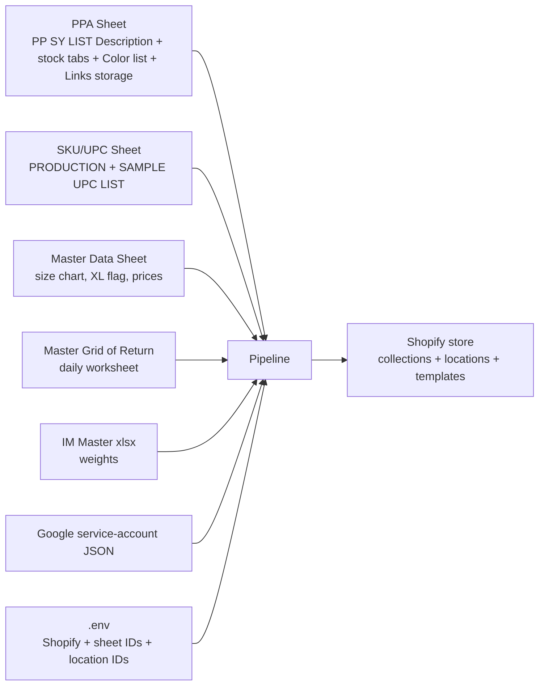

# PPA — Data Preparation Checklist

What must exist (and be filled in) so [main.py](main.py) (single style) and [return_product.py](return_product.py) (bulk from Master Grid of Return) can run cleanly.

Companion to [PPA_FLOW.md](PPA_FLOW.md) — that doc covers the *logic*, this one covers the *inputs*.

---

## 0. Dependency map at a glance



If any one of these is missing, mis-tabbed, or has wrong headers, **the affected step will silently fall back to empty values / `qty=0` / `barcode=""`**. The pipeline doesn't fail loudly — it fails quietly with bad data, behind a `try / except: traceback.print_exc()`. Verify each input below before a run.

---

## 1. Credentials & environment

| File | Purpose | Required keys / contents |
|---|---|---|
| `Setup/.env` | All sheet IDs, Shopify credentials, location IDs | See table below |
| `credentials/dialy-report-automation-e20c53e67542.json` | Google service-account key used by `gspread` and `googleapiclient` | Standard service-account JSON. The account must be **shared as Editor** on every Google Sheet listed in §2. |
| `Copy of <season> IM MASTER.xlsx` | Per-size weights | Lives in the project root. The current season's file must be present locally. |

`.env`, `credentials/`, and `*.xlsx` are all gitignored.

### `.env` keys actually consumed by the code

| Key | Used by | Notes |
|---|---|---|
| `CLIENT_ID` | Shopify OAuth (via `set_sy`) | Custom-app credentials |
| `CLIENT_SECRET` | Shopify OAuth (via `set_sy`) | Custom-app credentials |
| `PPA_SHEET_ID` | `PUD.decide` (reads `PP SY LIST`), `main.py` + `return_product.py` writes, `fetch_product_id_new.py` write, `ProductInfo` NE/Bali/Sample stock + Color list + Links storage reads | The "PPA sheet" with multiple tabs |
| `SKU_UPC_ID` | `ProductInfo.fetch_barcode`, `ProductInfo.get_sku_barcode`, `fetch_product_id_new.py` | The UPC sheet |
| `MASTER_DATA_ID` | `ProductInfo.get_metachart`, price lookups | Size chart + XL flag + prices |
| `RETURN_ID` | `return_product.py` (reads daily worksheet, writes link in column R) | Master Grid of Return |
| `NE_First_Choice_ID` | `set_inventory_metafield` for `fixed` / `sale_stock` (real NE qty) | Shopify location ID |
| `Bali_Stock_ID` | `set_inventory_metafield` for `fixed` / `sale_stock` (real Bali qty) | Shopify location ID |
| `NE_Sample_ID` | `set_inventory_metafield` for `sample` (qty from `get_sample_qty()`) | Shopify location ID |
| `Bali_To_Produce_ID` | `set_inventory_metafield` for `unfix` / `o4` (qty 5000 placeholder) | Shopify location ID |

Ten keys total. Shopify OAuth scopes the access token must have: `read_products`, `write_products`, `read_inventory`, `write_inventory`, `read_publications`, `write_publications`, `read_metaobjects`, `write_metaobjects`.

---

## 2. Google Sheets

### 2.1 PPA Sheet (`PPA_SHEET_ID`)

The primary sheet. Multiple tabs, all read by the pipeline.

#### 2.1.1 `PP SY LIST` — create vs update lookup + per-style description

- **Used by:** `PUD.decide` (read), `main.py` + `return_product.py` (write new rows after a successful create)
- **Header row:** row 1 (data starts row 2)
- **Required columns** (used as filter, source, or write target):
  - `Style` — substring match against `STYLE` param (case-insensitive)
  - `Color` — substring match against `COLOR` param (case-insensitive)
  - `Product ID` — Shopify numeric ID; the create-side writes this after a successful create
  - `Page Status` — must contain `"DRAFT"` for the pipeline to act; anything else is skipped
  - `FP/DC` — exact match (`"FP"` or `"DC"`)
  - `Description` — free-text paragraph injected into the product's `body_html` as `<p>{description}</p>`. **Looked up by `Style` substring only** (Color and FP/DC are ignored). The first matching row's value wins, so the description is effectively style-level, not variant-level.
- **`main.py` and `return_product.py` write** new rows starting at column **A** of the first row where `Style` is empty: `[STYLE, COLOR, product_id, "DRAFT", FP_DC]`. Column order must match the sheet's column order.
- ⚠️ **`Page Status` is a stale snapshot.** It's only refreshed by running `fetch_product_id_new.py`. Between snapshots, a Shopify product can drift DRAFT → ACTIVE without the sheet knowing. If `PP SY LIST` says DRAFT but Shopify says ACTIVE, the update will overwrite a live product.
- ⚠️ `PUD.decide` uses `str.contains` (substring + regex). If two styles share a prefix (`"EMORY TIPPED"` vs `"EMORY TIPPED L/S"`), the lookup may grab the wrong row. Keep style names disambiguated, or change the matcher to exact equality.
- ⚠️ **Description editing workflow:** since updates re-PUT `body_html`, editing a description in the Shopify admin will be clobbered on the next `update_*` run. Edit the `Description` cell in `PP SY LIST` instead.

#### 2.1.2 `NE STOCK` — NE warehouse stock + SKUs (per size)

- **Used by:** `ProductInfo.get_NE_qty` (returns `(qty, skus)` per size)
- **Required columns:**
  - `style` — substring filter against `self.style`
  - `color` — substring filter against `self.color`
  - `style_code` — used to build SKU stem: `<style_code>-<color>-<size>`
  - `X/S`, `S/M`, `M/L`, `X/L` — integer stock qty per size
- **Behavior:**
  - Returns `qty_ne = [X/S, S/M, M/L, X/L]` and `skus = ["<stem>-X/S", "<stem>-S/M", "<stem>-M/L", "<stem>-X/L"]`
  - If the filter yields **no rows**, returns `([0,0,0,0], ["","","",""])` (short-circuit; no crash).
- ⚠️ **The SKU returned is constructed from `style_code` + `color`, not read from a separate SKU column.** If `style_code` is mistyped or `color` is in a different format than the UPC list expects, `fetch_barcode` will fail to find a match → empty barcode.

#### 2.1.3 `BALI STOCK` — Bali warehouse stock + SKUs

- **Used by:** `ProductInfo.get_BALI_qty` (returns `(qty, skus)` per size)
- **Same columns as `NE STOCK`**, but:
  - **`X/L` is hardcoded to 0** in the return — Bali doesn't carry X/L sizes (by design)
  - Empty match → `([0,0,0,0], ["","","",""])`
- Used as a per-size fallback when `NE STOCK`'s SKU is blank for that size:
  ```python
  skus_chosen[i] = skus_ne[i] if str(skus_ne[i]).strip() else skus_ba[i]
  ```

#### 2.1.4 `NE SAMPLE STOCK` — sample inventory

- **Used by:** `ProductInfo.get_sample_qty`
- **Returns a scalar** (the `S/M` cell value, or `0` if no matching row). 
- ⚠️ Callers in `create_sample` / `update_sample` currently do `qty_sample[0]` as if it's a list. For string qtys this slices off the first character; for the integer `0` (no-match case) it raises `TypeError`. Bug — needs to be either dropped in callers or `get_sample_qty` changed to return `[qty]`.

#### 2.1.5 `Color list` — brand color → generic color mapping

- **Used by:** `Setup/generic_color_generator.py`
- Brand color (e.g. `"Ventana Blue"`) → generic family (`"Blue"`, `"Pink"`, etc.) for SEO + tag generation.
- Color string is `/`-split first, so multi-color brand colors (e.g. `"Cream/White/Khaki"`) get one generic per piece.
- **Side-effect:** if a brand color is not present, the generator calls GPT to propose one and **writes the new entry back to the sheet** for next time. This is the only undocumented sheet write that happens during a `create_*` or `update_*` call.

#### 2.1.6 `Links storage` — Shopify image URLs

- **Used by:** `ProductInfo.get_image`
- **Required columns:** `Filename`, `URL`
- The filename template is derived from `STYLE` (with abbreviations: `COTTON → CT`, `CREW → CR`, `CHUNKY → CH`, `LIGHTWEIGHT → LW`) and `COLOR` (slash → space, then space → dash). The function does substring-contains on `Filename` to gather all matching image URLs.
- If no rows match the abbreviated template, it retries with the raw style (no abbreviations) before giving up.
- ⚠️ A no-match returns an empty image list and prints a warning. The product is still created/updated — just with no images.

### 2.2 SKU / UPC Sheet (`SKU_UPC_ID`)

- **Used by:** `ProductInfo.get_sku_barcode` (default SKU + barcode), `ProductInfo.fetch_barcode` (lookup by SKU)
- **Two tabs:**
  - `PRODUCTION UPC LIST` — primary lookup for both default barcodes and `fetch_barcode`
  - `SAMPLE UPC LIST` — used by `get_sku_barcode` when `sample=True`
- **Header row:** row 5 (data starts row 6) — the code uses `values[5:]` and `columns=values[4]`. There's a TODO comment to inform PPIC to change the header row.
- **Required columns:**
  - `Lineitem sku` — the SKU string (must exactly match the SKU constructed in NE/BALI STOCK for `fetch_barcode` to find it; comparison is case-insensitive after `.strip().upper()`)
  - `UPC Barcode` — the barcode value posted to Shopify's variant `barcode` field
- ⚠️ If a SKU isn't in `PRODUCTION UPC LIST`, `fetch_barcode` returns `""` and the variant ships with no barcode. Shopify accepts this silently.

### 2.3 Master Data Sheet (`MASTER_DATA_ID`)

- **Used by:** `ProductInfo.get_metachart` (size chart HTML), `ProductInfo.get_price` (cascading price fallback), `ProductInfo.get_tags` (XL + printed flags)
- **Worksheet name** = `self.season_code` (e.g. `"S26"` for `"26 Spring"`, `"F26"` for `"26 Fall"`)
- **Header rows:** 10, 11, 12 (rows are forward-filled and joined as `"H1 | H2 | H3"`)
- **Required columns** (consulted, not exhaustive):
  - `FROM IM | DESCRIPTION`, `FROM IM | COLOR` — filter keys (substring)
  - `DEV | XL | (Y/N)` — toggles whether the size chart includes X/L and removes the `FILTERBY-X/L, L/XL, X/L,` tag chunk when `N`
  - `WEB | PRINTED | (Y/N)` — `Y` appends `hand printed, printed,` to tags
  - `... | UPDATED SIZE | ... | Width` and `... | UPDATED SIZE | ... | Length` per size — populate the size chart cells (with `ORIGINAL SIZE | ... | Width/Length` as fallback)
  - Various price columns: `IM PRICE`, `LATEST FULL PRICE`, `PB ADJUSTED FULL PRICE`, `LATEST SALE PRICE`, `PB ADJUSTED SALE PRICE`
- The size chart **always renders the master-data sizes**, not the filtered keep-sizes, by design (the chart is a reference, not a stock listing).

### 2.4 Master Grid of Return (`RETURN_ID`)

- **Used by:** `return_product.py` (read daily worksheet, write link to column R)
- **Worksheet name:** today's date formatted as `"%B %d, %Y"` (e.g. `"May 25, 2026"`) — generated from `date.today().strftime("%B %d, %Y")`.
- **Header row:** row 6 (data starts row 7)
- **Required columns:**
  - `Style`, `Color` — passed to `PUD.decide`
  - `Added to full price`, `Added to sale` — values `"x"` (case-insensitive) decide FP vs DC:
    - FP marked, DC blank → `FP_DC="FP"`, `SALE=False` → `create_fixed()` or `update_fixed()`
    - DC marked, FP blank → `FP_DC="DC"`, `SALE=True` → `create_sale_stock()` or `update_sale_stock()`
    - Both `x` → log + skip
    - Neither → log + skip
  - Any column with `"ZZ"` in its header — used as an exclusion filter. Rows where any such column equals `"ZZ"` are dropped entirely from the iteration. After ZZ filtering, rows are deduplicated by `(Style, Color)`.
  - **Column R** — the destination cell where each row's Shopify admin link is written after a successful create or update.
- ⚠️ The Master Grid sheet can have **duplicate column headers**; `return_product.py` uses a `_first()` helper to handle that: `_first(x)` returns `x.iloc[0]` if `x` is a Series, else `x`. Don't remove it.
- ⚠️ Column `R` is hardcoded. Verify it's actually the link column in your Master Grid before a run.

---

## 3. Local Excel file — IM Master (`Copy of <season> IM MASTER.xlsx`)

- **Used by:** `ProductInfo.get_weight` (per-variant weight)
- **Location:** project root (alongside `main.py`). Path is built as `f"Copy of {self.season_code} IM MASTER.xlsx"`.
- **Header row:** `config/varia.py` → `IM_header = 56` (pandas `header=56`)
- **Required columns:**
  - `DESCRIPTION` — substring filter against STYLE; also must contain the size code (`S/M`, `M/L`, …) for the per-size weight lookup. For `sample=True` runs, only rows containing `S/M` are kept.
  - `WS TAG COLOR` — filter against COLOR
  - `PRE COMPONENT WT (PC WT)` — weight in **kg** (multiplied by 1000 → grams for Shopify)
- ⚠️ The script reads the xlsx via `pd.read_excel(path)`. If the file isn't synced locally to the user running the script, the read raises `FileNotFoundError` and the surrounding try/except logs the trace.
- ⚠️ Per-season filename change. For `26 Spring` the file is `Copy of S26 IM MASTER.xlsx`. For `26 Fall` it would be `Copy of F26 IM MASTER.xlsx`. Confirm the file exists before a run.

---

## 4. Shopify-side prerequisites

These are configured **inside the Shopify store**, not in a file.

### 4.1 Inventory location IDs

All four must exist in the store and their numeric IDs must be set in `.env`:

| Env var | Used by (create-side) | Update-side behavior |
|---|---|---|
| `NE_First_Choice_ID` | `fixed` + `sale_stock` (NE qty) | Always written. Zeroed for `unfix`/`sample`/`o4`. |
| `Bali_Stock_ID` | `fixed` + `sale_stock` (Bali qty) | Always written. Zeroed for `unfix`/`sample`/`o4`. |
| `NE_Sample_ID` | `sample` (`get_sample_qty()` value) | Always written. Zeroed for non-`sample` types. |
| `Bali_To_Produce_ID` | `unfix` + `o4` (qty 5000 placeholder) | Always written. Zeroed for `fixed`/`sale_stock`/`sample`. |

Verify each still resolves: `GET /admin/api/2026-01/locations.json`.

> **Note on the create/update divergence:** `CreatePP.set_inventory_metafield` only posts to the location(s) relevant to the type. `UpdatePP.set_inventory_metafield` posts to all four and zeros out the irrelevant ones. This is an intentional reset semantic on update — see [PPA_FLOW.md §6](PPA_FLOW.md).

### 4.2 Theme templates

The active theme must publish both product templates:

- `default` — used when `template_suffix` resolves to `'default'` (full-price products)
- `sale-item` — used when `template_suffix` resolves to `'sale-item'` (sale products)
- `nearly-gone` — used when `tg.additional_tags` finds `qty == 1` or `qty < 6`

`tg.additional_tags` returns a suggested `template_suffix`; if it returns `None`, the fallback is `'sale-item' if SALE else 'default'`. If `nearly-gone` or `sale-item` doesn't exist in the live theme, Shopify accepts the product but falls back to default rendering — meaning sale items / nearly-gone items won't render with their styling.

### 4.3 Publication channels

`set_sy.publish_to_all_channels(product_id, sale=...)`:

- `sale=False` → publish to **every** sales channel returned by `publications(first: 20)`.
- `sale=True` → publish to every channel **except Pinterest**.

Caller usage:
- `create_unfix` / `create_fixed` → explicitly pass `sale=False` (full-price → Pinterest included)
- `create_sample` / `create_sale_stock` / `create_o4` → use the default `sale=True` (Pinterest excluded)
- Update methods do **not** call `publish_to_all_channels` — publish state from the original create stays.

If you want different channel handling, edit the GraphQL filter in [Setup/set_sy.py](Setup/set_sy.py).

### 4.4 Tax code metafield

- Namespace: `avalara`, key: `taxcode`, value: `PC040100`
- Set at the product level (in the create payload) and per-variant level (after creation, in `set_inventory_metafield`, on both create and update).
- No prerequisite metafield definition needed — Shopify auto-creates on first write.
- ⚠️ Every update re-POSTs the per-variant metafield. Shopify usually dedupes by `(owner_id, namespace, key)`, but if you see duplicate `avalara.taxcode` metafields on a variant in the admin, the dedup isn't holding and the create-or-update should be switched to GraphQL `metafieldsSet`.

---

## 5. Per-row data quality rules

For one row in the Master Grid of Return (or one style targeted by main.py) to produce a clean update, **every dependent lookup must hit a matching row**.

| Lookup | Match keys | Sheet/file | Failure mode |
|---|---|---|---|
| Decide create vs update | `Style` substring, `Color` substring, `FP/DC` exact | `PPA_SHEET_ID` → `PP SY LIST` | No row → `create_new=True, status="DRAFT"` (forced) → create branch |
| Per-style description | `Style` substring (no Color, no FP/DC) | `PPA_SHEET_ID` → `PP SY LIST` | No row → `description = ""` (empty `<p></p>` in body) |
| NE qty + SKU | `style` substring, `color` substring | `PPA_SHEET_ID` → `NE STOCK` | Empty → `([0,0,0,0], ["","","",""])` |
| Bali qty + SKU | `style` substring, `color` substring | `PPA_SHEET_ID` → `BALI STOCK` | Empty → `([0,0,0,0], ["","","",""])`. Together with NE empty → `keep=[]` → "No stock" skip |
| Sample qty | `style` substring, `color` substring | `PPA_SHEET_ID` → `NE SAMPLE STOCK` | Empty → `0` (int); see §2.1.4 caller bug |
| Barcode by SKU | Exact normalized SKU | `SKU_UPC_ID` → `PRODUCTION UPC LIST` | Missing → barcode = `""` |
| Default SKU + barcode (unfix/sample/o4) | Style+Color filter | `SKU_UPC_ID` → `PRODUCTION UPC LIST` / `SAMPLE UPC LIST` | Missing → variant gets empty SKU/barcode |
| Size chart + XL/printed flags + prices | `FROM IM \| DESCRIPTION` substring, `FROM IM \| COLOR` substring | `MASTER_DATA_ID` → `<season_code>` tab | Empty → crashes at `.iloc[0]` in `get_metachart` / `get_price` |
| Generic color | Per-`/`-separated color piece | `PPA_SHEET_ID` → `Color list` | Missing → GPT proposes + writes back |
| Weight | STYLE + COLOR + size code | IM Master xlsx | Missing → empty weights list, then `len(sizes) != len(weights)` issues downstream |
| Images | Filename substring (abbreviated; raw retry) | `PPA_SHEET_ID` → `Links storage` | Missing → empty images list, warning printed |

**Pre-run rule of thumb:** for each row before pressing play, confirm the `(STYLE, COLOR)` pair appears in:

1. `NE STOCK` and/or `BALI STOCK` (at least one must have non-zero qty for fixed / sale_stock to proceed)
2. `PRODUCTION UPC LIST` with a non-empty `UPC Barcode` for every NE SKU you expect to ship
3. `MASTER_DATA_ID` (required — size chart and price lookups will crash without it)
4. `Color list` (or accept that GPT will write a new entry)
5. IM Master xlsx (for weights)
6. `Links storage` (for images)
7. `PP SY LIST` if you want it to be an update; absent → create. Also fill the `Description` cell if you want a body paragraph.

---

## 6. Per-season tweaks (what changes when starting `S27`, `F26`, …)

| Where | What | Action |
|---|---|---|
| `main.py` | `SEASON = "26 Spring"` constant | Update to new season string |
| `return_product.py` | `SEASON = "26 Spring"` (hardcoded inside the loop) | Update to new season string |
| Project root | `Copy of S26 IM MASTER.xlsx` | Add the new season's file; remove or archive old one |
| `config/varia.py` | `IM_header = 56`, `season = "26 Spring"` | Confirm header row didn't shift; `season` value is informational (not currently imported by the runtime path) |
| `MASTER_DATA_ID` | New worksheet matching the new `season_code` (`S27`, `F26`, …) | Make sure every style+color this season has rows, with size chart cells and prices populated |
| `PPA_SHEET_ID` → `NE STOCK` / `BALI STOCK` | New season rows + stock counts | Updated by stock team |
| `PPA_SHEET_ID` → `NE SAMPLE STOCK` | New season sample rows | Updated by stock team |
| `PPA_SHEET_ID` → `Color list` | New colors | Add manually or let GPT write them on first reference |
| `PPA_SHEET_ID` → `Links storage` | New season image filenames + URLs | Required for images to attach |
| `SKU_UPC_ID` → `PRODUCTION UPC LIST` | New SKUs + barcodes for the season | Critical — empty `UPC Barcode` cells = empty barcodes on Shopify |
| `RETURN_ID` | A daily worksheet matching `date.today().strftime("%B %d, %Y")` (e.g. `"May 25, 2026"`) must exist before `return_product.py` runs | Ops creates the daily tab |

There's no single `SeasonConfig` object yet — these are scattered. A consolidation would be a useful refactor.

---

## 7. Naming-convention contracts (parser depends on these)

`ProductInfo` parses substrings from `STYLE` and `COLOR` to derive product type, tags, fabric category, etc.

### STYLE string — what `get_type()` looks for

`ProductInfo.get_type()` resolves Shopify `product_type` via this first-match cascade (substrings of the uppercase style):

| Substring | `product_type` |
|---|---|
| `" V "` (space-bracketed) | `V-neck` |
| `CREW` | `Crewneck` |
| `CARDI` | `Cardigan` |
| `" T "` (space-bracketed) | `T-neck` |
| `" COLLAR "` (space-bracketed) | `Collar` |
| (none of the above) | `""` (empty) |

### STYLE string — what tag/composition logic looks for

`ProductInfo.title_and_desc` and `Setup/tags_generator.generate_tags`:

- **Composition branch:** last token of `STYLE.split(" ")` — `COTTON` or `MERCER` → `60% cotton, 40% acrylic`; anything else → `76% acrylic, 12% Mohair and 12% Wool`.
- **Tag triggers** (substring tests on uppercase STYLE): `COTTON`, `MERCER`, `CHUNKY` (else `lightweight`), `TEE`, `3/4`, `HALF SLEEVE` (else long sleeve default), `HOODIE`, `ZIP`, `CARDIGAN`/`CARDI`, `STRIPED`, `PRINTED`, `MARLED`/`HEATHERED`, `POCKET`, `CABLE`, `V`, `CREW`, `COLLAR`.

### COLOR string

- Multi-color colors are slash-separated. `Color list` lookup runs per-piece (`"Cream/White/Khaki"` → 3 generic-color lookups).
- Substring `MULTI` in color → adds `Multi,` to tags.
- Special generic-color tag expansions: `Purple → Purple, Violet`; `White`/`Black`/`Grey`/`Brown` → adds `Neutral`; `Grey → Grey, Gray`; `Brown → Brown, Chocolate, Tan, Cream, Nude`.

### FP_DC mapping (driven by production_type or sheet column)

| production_type | FP_DC | SALE |
|---|---|---|
| `unfix`, `fixed` | `FP` | `False` |
| `sale_stock`, `sample`, `o4` | `DC` | `True` |

---

## 8. Pre-flight checklist

Before running:

- [ ] `Setup/.env` has all 10 keys from §1
- [ ] `credentials/dialy-report-automation-e20c53e67542.json` is present and the service account is shared as Editor on the PPA Sheet, SKU/UPC Sheet, Master Data Sheet, and Master Grid of Return
- [ ] Project root has `Copy of <season> IM MASTER.xlsx`
- [ ] `(STYLE, COLOR)` appears in either `NE STOCK` or `BALI STOCK` (for fixed/sale_stock)
- [ ] Every NE SKU expected to ship has a row in `PRODUCTION UPC LIST` with non-empty `UPC Barcode`
- [ ] Brand color is in `Color list` (or you're OK letting GPT write it)
- [ ] `MASTER_DATA_ID` has a row for `(STYLE, COLOR)` with size chart cells populated (otherwise `get_metachart` / `get_price` crash on `.iloc[0]`)
- [ ] IM Master xlsx has rows for `(STYLE, COLOR)` with `PRE COMPONENT WT` filled per size
- [ ] `Links storage` has rows whose `Filename` substring-matches the style+color image template
- [ ] All 4 Shopify location IDs in `.env` still resolve (`GET /locations.json`)
- [ ] Active theme has the `default`, `sale-item`, and `nearly-gone` templates
- [ ] `PP SY LIST.Description` cell is populated for the style (or you accept an empty `<p></p>` in body)
- [ ] (For bulk run) Master Grid of Return has a daily worksheet named `date.today().strftime("%B %d, %Y")` (e.g. `"May 25, 2026"`)
- [ ] (For bulk run) Column `R` on that worksheet is the link/result column
- [ ] (For bulk run) `return_product.py` has been patched to unpack 4 returns from `PUD.decide` and pass `description` into `CreatePP` / `UpdatePP` — currently broken against those signatures, see [PPA_FLOW §11](PPA_FLOW.md#11-known-gaps--open-items)

If all checks pass, the pipeline should run cleanly.
