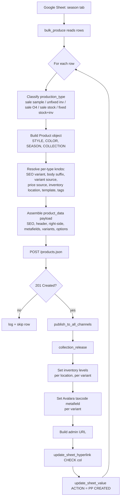

# PPA — Product Page Automation: Flow & Branch Summary

This document captures everything the current `main_underdev` + `create_product_underdev` pipeline
does, so a clean rewrite can be planned without re-reading the messy code.

The big insight: **the 5 product-type "branches" share ~90% of the same flow.**
They only differ in a few knobs (variant source, price source, inventory location, template suffix, body suffix).
The redesign should be **one `create_product()` function driven by a per-type config**, not 5 separate functions.

---

## 1. High-level flow



---

## 2. The common pipeline (true for every branch)

Every product type executes the **same 10 conceptual steps**. The current code repeats this
~5 times with copy-paste — that is the main source of mess.

| # | Step | Where today |
|---|------|-------------|
| 1 | Read row (STYLE, COLOR, COLLECTION) | `main_underdev.py` loop |
| 2 | Instantiate `Product(...)` | each `create_*` |
| 3 | Pull SEO (`get_seo`) — pick correct tuple position | each `create_*` |
| 4 | Pull title + body (`title_and_desc`) | each `create_*` |
| 5 | Pull variant data (sizes, SKUs, stocks) | branch-specific source |
| 6 | Pull weights, barcodes, tags, metafield, type | each `create_*` |
| 7 | Pull price (full / sale / zero) | branch-specific source |
| 8 | Build variants[] and options[] | each `create_*` |
| 9 | POST product → publish → add to collection | each `create_*` |
| 10 | Set inventory + per-variant taxcode metafield | each `create_*` |

---

## 3. What actually differs per branch

The only real differences:

| Branch (ptype) | Function today | SEO tuple pick | Body | Variant source | Price source | Inventory location | Inv qty | Template | sale tag | sample tag |
|---|---|---|---|---|---|---|---|---|---|---|
| `sale sample` | `create_sale_sample` | `_, title_seo, desc_seo, _, handle_seo` (sale orientation) | `desc_sale + thread_comp` | `product.ne_sample()` — single S/M (6-8), SKU gets `-S` suffix | `0, 0` | `NE_Sample_ID` | real `stocks` | `sale-item` | yes | yes |
| `unfixed inv` | `create_unfix` | `title_seo, _, desc_seo, handle_seo, _` (full orientation) | `thread_comp` only | `product.unfix()` — all sizes | `get_fullprice()` | `Bali_To_Produce_ID` | hardcoded `5000` | *(none)* default | no | no |
| `sale O4` | `create_04` | `_, title_seo, desc_seo, _, handle_seo` (sale orientation) | `sale_desc + thread_comp` | `product.unfix()` — all sizes | `get_price()` (price + compare_at) | `NE_Sample_ID` | hardcoded `5000` | `sale-item` | yes | no |
| `sale stock` | `create_fixed(sale=True)` | `_, title_seo, desc_seo, _, handle_seo` (sale orientation) | `sale_desc + thread_comp` | `ne_first_choice()` + `bali_stocks()` merged in size order X/S→S/M→M/L→X/L | `get_price()` | `NE_First_Choice_ID` and/or `Bali_Stock_ID` | real `stocks_n` / `stocks_b` per variant | `sale-item` | yes | no |
| `fixed stock` / `fixed inv` | `create_fixed(sale=False)` | `title_seo, _, desc_seo, handle_seo, _` (full orientation) | `thread_comp` only | `ne_first_choice()` + `bali_stocks()` merged | `get_fullprice()` | `NE_First_Choice_ID` and/or `Bali_Stock_ID` | real stocks per variant | `default` | no | no |

Everything else (vendor, taxcode, publish flow, collection_release, status=draft, published_scope=web,
weight unit, options shape, variant metafield post) is **identical across all 5 branches**.

---

## 4. Per-branch quick reference cards

### 4.1 `sale sample`
- One variant only: `S/M (6-8)`
- SKU: `<base_sku>-S`
- Price: `0` (placeholder)
- Stock: real qty from NE Sample sheet
- Use case: sample units being sold off

### 4.2 `unfixed inv`
- All sizes via `Product.unfix()` (size set comes from master data, not real warehouse counts)
- Full retail price
- Inventory: dummy 5000 at Bali To Produce — meaning "not really stocked, placeholder for selling pre-made"
- Use case: products with no warehouse stock yet, accepting pre-orders or made-to-order

### 4.3 `sale O4`
- All sizes via `Product.unfix()`
- Sale price + compare_at price
- Inventory: dummy 5000 at NE Sample (likely a bug — same dummy idea as unfix but a different location)
- Use case: discounted items where actual stock count doesn't matter (clear-out / promo)
- Current code has a real bug: `options.append=(...)` (line 753) is an attribute assignment, not a list append. Options never get added.

### 4.4 `sale stock`  (`create_fixed(sale=True)`)
- Real sizes + stock counts from NE First Choice and/or Bali Stock master sheets
- Sale price + compare_at price
- Inventory: real qty written per variant per location
- Use case: discounted items being sold from real, counted warehouse stock

### 4.5 `fixed stock` / `fixed inv`  (`create_fixed(sale=False)`)
- Same variant source as `sale stock`
- Full retail price
- Inventory: real qty per variant per location
- Use case: standard, full-price products with real warehouse stock

---

## 5. Known bugs and smells in current code (carry over knowledge into the rewrite)

1. **`create_04` options bug** — `options.append=(...)` overwrites the method instead of calling it. Options are never populated; the product is created with empty `options: []`. Use `options.append({...})` or build the list with a comprehension.
2. **`create_fixed` double loop** — `for collection, product_name, color_raw in products:` is then immediately followed by `for p in products:` inside. The outer loop is dead and unpacks wrong (`products` is a list of dicts, not tuples). Each product is processed N times where N = len(products).
3. **`create_unfix` bali stock qty** — never queries Bali stock; always writes 5000 at `Bali_To_Produce_ID`. Confirm that is the intent.
4. **`create_fixed` bali index bug** — inner loop uses `for variant in data[...].variants` but reads `stocks_b[i]` where `i` is whatever the previous loop left behind, not the current variant's index.
5. **`create_sale_sample` retry-on-exception** — `except Exception` retries the *same* payload with the same data. The retry-without-image comment suggests the original intent was to strip images, but the retry payload is identical to the first. Either drop the retry or actually mutate the payload.
6. **Per-row `time.sleep(1)`** — fine for now but should be a single configurable rate-limit at the API layer, not sprinkled in every function.
7. **`get_seo()` returns a 5-tuple where the meaningful pick depends on sale/full** — caller indexes with `_` placeholders. Cleaner: `product.get_seo(sale=True/False)` returns a dict.
8. **`title_and_desc` returns a 4-tuple with similar pattern** — same fix: return a dict or two named methods (`title_and_desc_full()` / `title_and_desc_sale()`).
9. **No idempotency / no dedup** — if a row is re-run after a partial failure (e.g. product POST succeeded but inventory POST failed), the next run creates a duplicate product. Consider checking by SKU before POST or storing the product_id back into the sheet immediately after creation.
10. **Status code is checked AFTER `publish_to_all_channels` and `collection_release` are called on a possibly-failed product** — move the `if response.status_code != 201: continue` check to immediately after the POST.

---

## 6. Proposed clean redesign (sketch — not code)

One unified function driven by a config dict / dataclass:

```text
PRODUCT_TYPE_CONFIG = {
    "sale sample": ProductTypeSpec(
        seo_mode="sale",
        body_mode="sale",            # desc_sale + thread_comp
        variant_source="ne_sample",  # returns (sizes, SKUs, stocks)
        sku_suffix="-S",
        price_source="zero",
        inventory=[InventoryWrite(location=NE_Sample_ID, qty_from="stocks")],
        template_suffix="sale-item",
        tags=dict(sale=True, sample=True),
    ),
    "unfixed inv": ProductTypeSpec(
        seo_mode="full",
        body_mode="full",            # thread_comp only
        variant_source="unfix",
        price_source="full",
        inventory=[InventoryWrite(location=Bali_To_Produce_ID, qty_from="literal:5000")],
        template_suffix=None,
        tags=dict(sale=False, sample=False),
    ),
    # ... sale O4, sale stock, fixed stock
}

def create_product(p_row, season, spec: ProductTypeSpec) -> str | None:
    product = Product(p_row["STYLE"], p_row["COLOR"], season, p_row["COLLECTION"])
    seo      = product.get_seo(mode=spec.seo_mode)
    body     = product.body(mode=spec.body_mode)
    variants = build_variants(product, spec)        # uses spec.variant_source + spec.sku_suffix
    price    = resolve_price(product, spec)         # full / sale / zero
    payload  = assemble_payload(product, seo, body, variants, price, spec)
    pid      = post_product(payload)
    publish_and_collect(pid, p_row["COLLECTION"])
    write_inventory(pid, spec)
    write_tax_metafields(pid)
    return admin_url(pid)
```

Then `main` becomes:

```text
for row in rows:
    spec = PRODUCT_TYPE_CONFIG[row["PTYPE"]]
    link = create_product(row, season, spec)
    update_sheet(row, link, "PP CREATED")
```

Benefits:
- One place to fix the publish/inventory/tax pipeline.
- New product types = new config row, not new function.
- The known bugs above become unrepresentable (e.g. options.append typo can't happen, double-loop can't happen).
- Easier to unit-test (`resolve_price`, `build_variants`, `assemble_payload` are all pure).

---

## 7. Files involved

- [main_underdev.py](main_underdev.py) — entry point, row loop, dispatch
- [create_product_underdev.py](create_product_underdev.py) — the 4 functions (sale_sample, fixed, unfix, 04)
- [all_function_list_underdev.py](all_function_list_underdev.py) — `Product` class: master-data reads, SEO, prices, variants, tags, weights, barcodes
- [Setup/set_sy.py](Setup/set_sy.py) — `get_token`, `publish_to_all_channels`, `collection_release`
- `pp_status.py` (referenced by main; not yet inspected) — `bulk_produce`, `update_sheet_hyperlink`, `update_sheet_value`
