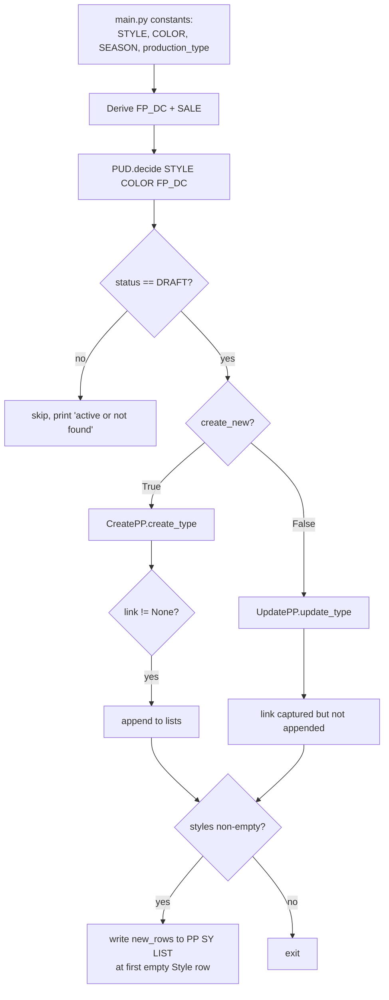
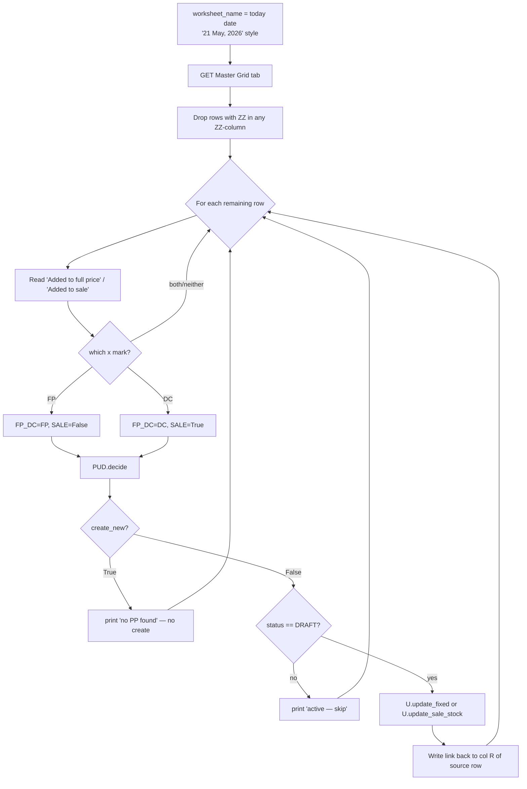

# PPA — Product Page Automation: Flow & Branch Summary

What the current pipeline does, end-to-end. Companion to [PPA_DATA_PREP.md](PPA_DATA_PREP.md) (inputs) and [README.md](README.md) (setup + quick reference).

The big insight: there are **two entry points** and **two operations** (create / update), but the per-production-type logic is consolidated into one `product_post()` helper in each of [create_pp.py](create_pp.py) and [update_pp.py](update_pp.py). The five production types share the same skeleton — they differ only in `ProductInfo` flags, inventory location, and (for `fixed` / `sale_stock`) stock-based filtering.

---

## 1. Two entry points

### 1.1 Single-style manual run ([main.py](main.py))

Edit constants at top, run `python main.py`.



### 1.2 Bulk sheet-driven run ([return_product.py](return_product.py))

Reads today's worksheet from Master Grid of Return, iterates rows.



`return_product.py` **only updates** — it cannot create. New products must go through `main.py`. Returns are tracked here because each row's link is logged in column R of the source sheet.

---

## 2. The decision: create vs update ([post_update_decision.py](post_update_decision.py))

```python
def decide(STYLE, COLOR, FP_DC):
    # reads PP SY LIST tab of PPA sheet
    df = df[
        df["Style"].str.contains(STYLE, case=False, na=False) &
        df["Color"].str.contains(COLOR, case=False, na=False) &
        (df["FP/DC"] == FP_DC)
    ]
    if df.empty:
        return True, "", "DRAFT"        # not in sheet → treat as new
    return False, df['Product ID'].iloc[0], df['Page Status'].iloc[0]
```

| `df.empty` | returned `create_new` | returned `product_id` | returned `status` | Caller behavior |
|---|---|---|---|---|
| True | `True` | `""` | `"DRAFT"` (forced) | run CreatePP |
| False, sheet DRAFT | `False` | `<int>` | `"DRAFT"` | run UpdatePP |
| False, sheet ACTIVE | `False` | `<int>` | `"ACTIVE"` | **skip** (don't overwrite live product) |

The `"DRAFT"` forced-default means "no row in sheet" is treated identically to "row in sheet with DRAFT status" — both proceed to act on the product (create / update).

---

## 3. The five production types

| Type | `sample` | `sale` | `sas` | Sizes | Inventory location(s) | FP_DC | SALE |
|---|---|---|---|---|---|---|---|
| `unfix` | F | F | F | All 4 (template) | `Bali_To_Produce_ID` qty 5000 | FP | False |
| `fixed` | F | F | F | Only sizes with NE+Bali stock > 0 | `NE_First_Choice_ID` + `Bali_Stock_ID` real qty | FP | False |
| `sample` | T | T | F | S/M only | `NE_Sample_ID` qty `qty_sample[0]` | DC | True |
| `sale_stock` | F | T | F | Only sizes with NE+Bali stock > 0 | `NE_First_Choice_ID` + `Bali_Stock_ID` real qty | DC | True |
| `o4` | F | T | T | All 4 (template) | `Bali_To_Produce_ID` qty 5000 | DC | True |

`fixed` and `sale_stock` are the only types that read live stock; the other three are placeholders.

---

## 4. The common pipeline

Every `create_*` / `update_*` method runs these conceptual steps in roughly the same order:

| # | Step | Where |
|---|------|-------|
| 1 | Construct `ProductInfo(STYLE, COLOR, SEASON, sample=, sale=, sas=)` | top of each method |
| 2 | *(fixed/sale_stock only)* `qty_ne, skus_ne = P.get_NE_qty()`; `qty_ba, skus_ba = P.get_BALI_qty()` | top of method |
| 3 | *(fixed/sale_stock only)* Build `keep` = indices where `qty_ne + qty_ba > 0`; skip product if `keep == []` | top of method |
| 4 | *(fixed/sale_stock only)* Build `skus_chosen` (NE primary, Bali fallback) and `barcodes_chosen = P.fetch_barcode(skus_chosen)` | top of method |
| 5 | *(update only)* `GET /products/{id}.json` → build `sku_to_id = {sku: id}` map | mid-method |
| 6 | `product_post(P, keep=, qty=, skus=, barcodes=)` builds the Shopify payload (variants, options, tags, template_suffix) | shared helper |
| 7 | *(update only)* Stamp `v["id"] = sku_to_id[v["sku"]]` on each new variant whose SKU exists | mid-method |
| 8 | `POST /products.json` (create) or `PUT /products/{id}.json` (update) | end of method |
| 9 | *(create only)* `set_sy.publish_to_all_channels(product_id, sale=...)` | after POST |
| 10 | `set_inventory_metafield(response, type, qty_ne=, qty_ba=, qty_sample=)` per-variant inventory + Avalara taxcode metafield | end of method |
| 11 | Return `(link, product_id)` (create) or `link` (update). Failures return `(None, None)` / `None`. | end of method |

---

## 5. Create flow ([create_pp.py](create_pp.py))

```
CreatePP(STYLE, COLOR, SEASON, SALE).create_<type>()
   │
   ├── P = ProductInfo(STYLE, COLOR, SEASON, sample=, sale=, sas=)
   │
   ├── [fixed / sale_stock only]
   │     qty_ne, skus_ne = P.get_NE_qty()        ← reads NE STOCK
   │                                                empty → ([0,0,0,0], ["","","",""])
   │     qty_ba, skus_ba = P.get_BALI_qty()      ← reads BALI STOCK (X/L always 0)
   │     combined = qty_ne + qty_ba (per size, _to_int)
   │     keep = indices where combined > 0
   │     if not keep:  return (None, None)        ← skip product, no stock
   │     skus_chosen[i]  = skus_ne[i] if non-blank else skus_ba[i]
   │     barcodes_chosen = P.fetch_barcode(skus_chosen)    ← UPC LIST lookup
   │     filter qty_ne / qty_ba by keep
   │     total_qty = sum(filtered qty_ne + qty_ba)
   │
   ├── product_data = self.product_post(P, keep=, qty=, skus=skus_chosen?, barcodes=barcodes_chosen?)
   │     │
   │     ├── P.title_and_desc()         title, sale title, body HTML, thread composition
   │     ├── P.get_SEL()                SEO page title, meta description, handle
   │     ├── P.get_weight()             sizes + per-variant weight (IM Master xlsx)
   │     ├── P.get_sku_barcode()        default barcodes + default SKUs (UPC LIST)
   │     │                               — used as fallback only
   │     ├── P.get_metachart()          size chart HTML (MASTER_DATA sheet)
   │     ├── P.get_tags()               base tag string (per-type tags + color + dated tag)
   │     ├── tg.additional_tags(tags, sizes, qty) → (tags, template_suffix)
   │     ├── P.get_type()               product_type derived from STYLE last token
   │     ├── P.get_price()              full_price + sale price (cascading fallback)
   │     ├── [if keep]                  filter sizes/weights/default_barcodes/default_skus by keep
   │     ├── skus     = skus_kwarg     if provided else default_skus
   │     ├── barcodes = barcodes_kwarg if provided else default_barcodes
   │     └── return assembled Shopify product payload
   │
   ├── POST /admin/api/2026-01/products.json
   │     └── non-201 → print, return (None, None)
   │
   ├── set_sy.publish_to_all_channels(product_id, sale=self.sale)
   │       sale=True excludes Pinterest, sale=False includes all
   │
   ├── set_inventory_metafield(response, type, qty_ne=, qty_ba=, qty_sample=)
   │     │
   │     ├── fixed / sale_stock → per-variant POST to NE_First_Choice_ID (qty_ne[i])
   │     │                        and Bali_Stock_ID (qty_ba[i])
   │     ├── sample              → per-variant POST to NE_Sample_ID (qty_sample[0])
   │     ├── unfix / o4          → per-variant POST to Bali_To_Produce_ID (qty=5000)
   │     └── per-variant POST to Avalara taxcode metafield
   │
   └── return (link, product_id)
```

`create_*` is wrapped in `try / except Exception: traceback.print_exc(); return (None, None)`. All failure paths return `(None, None)`.

---

## 6. Update flow ([update_pp.py](update_pp.py))

Mirrors create, except the product already exists on Shopify and we PUT instead of POST.

```
UpdatePP(STYLE, COLOR, SEASON, PRODUCT_ID, SALE).update_<type>()
   │
   ├── P = ProductInfo(...)
   │
   ├── [fixed / sale_stock only]
   │     same stock filter + skus_chosen + barcodes_chosen as create
   │     (empty match short-circuits to all-zero qty/blank SKUs → "No stock" skip → return None)
   │
   ├── GET /admin/api/2024-01/products/{PRODUCT_ID}.json
   │     └── sku_to_id = {v.sku: v.id for v in existing if v.get("sku")}
   │
   ├── variants, options, tags, template_suffix = self.product_post(self.COLOR, P, keep=, qty=, skus=, barcodes=)
   │
   ├── for v in variants:
   │       if v["sku"] in sku_to_id:
   │           v["id"] = sku_to_id[v["sku"]]      ← Shopify treats as in-place update
   │
   ├── PUT /admin/api/2024-01/products/{PRODUCT_ID}.json
   │     payload = {"product": {"id", "variants", "options", "tags", "template_suffix"}}
   │
   ├── set_inventory_metafield(response, type, qty_ne=, qty_ba=, qty_sample=)
   │     (same per-variant inventory + tax metafield as create)
   │
   └── return link
```

### Shopify PUT semantics

- Variant **with** `id` → update in place.
- Variant **without** `id` → create.
- Existing variant **omitted** from the new array → deleted.

Fields not included in the PUT body (`status`, `title`, `description`, `images`, etc.) are left untouched, so a DRAFT product stays DRAFT.

---

## 7. Inventory & SKU/barcode sourcing

Per production type, the variants get sourced from different sheets:

| Type | SKU source | Barcode source | Why |
|---|---|---|---|
| `unfix`, `sample`, `o4` | `PRODUCTION UPC LIST` / `SAMPLE UPC LIST` via `P.get_sku_barcode()` | Same (positional pairing) | Placeholder products — use the canonical UPC list |
| `fixed`, `sale_stock` | NE STOCK (primary), Bali STOCK (fallback) per size | `PRODUCTION UPC LIST` looked up **by SKU** via `P.fetch_barcode(skus_chosen)` | Real-stock products — SKU must reflect what's actually shippable; barcode joined by value, not position |

`fetch_barcode` returns `""` for unknown SKUs and Shopify accepts empty strings. If both `skus_ne[i]` and `skus_ba[i]` are blank for a size that has `qty > 0`, the variant ends up with `sku=""` and `barcode=""` — a data-entry symptom worth investigating.

---

## 8. Key derived fields

- **Sizes**: `X/S`, `S/M`, `M/L`, `X/L`. The `SIZE_RANGE` constant maps each to a body-size label (`S/M → (6-8)`) used for the Shopify variant `option1` text.
- **Size chart**: rendered HTML from `MASTER_DATA_ID`. Shows all 4 sizes regardless of stock filtering — by design (reference, not a stock listing). `DEV | XL | (Y/N)` flag toggles whether X/L is included.
- **Generic color**: looked up in the `Color list` tab of the PPA sheet. If absent, GPT proposes one and writes it back to the sheet (undocumented side-effect during create).
- **Price**: `P.get_price()` returns `(full_price, sale_price)` with a cascading fallback: `PB ADJUSTED ...` → `LATEST ...` → `IM PRICE`.
- **Template suffix**: `tg.additional_tags` returns one; if `None`, fallback is `'sale-item'` when `self.sale=True` else `'default'`.
- **Tags**: base tags from `P.get_tags()` (per-type + color family + dated `Additional <Mon DD YYYY>`), plus appendage from `tg.additional_tags` (qty/size-driven).
- **Status**: products are always created `draft` (Shopify status). Updates don't change status — the PUT body omits the `status` field.

---

## 9. Error handling & idempotency

- All `create_*` / `update_*` methods are wrapped in `try / except Exception: traceback.print_exc()`. They never raise; they return `(None, None)` / `None` on failure.
- `main.py` checks `if link is not None:` before appending to its accumulator lists, so a failed create doesn't pollute the PP SY LIST writeback.
- `return_product.py` writes the link unconditionally inside its DRAFT branch — if `link is None` (e.g. no stock), it writes `None` to the cell. Guard with `if link:` before the sheet write if that matters.
- **No idempotency on create**: a failed mid-create (e.g. POST succeeded but inventory POST failed) leaves an orphaned Shopify draft. Re-running creates a duplicate. Mitigation: PP SY LIST writeback happens after all sub-calls, so a row not in PP SY LIST is a signal the create didn't complete cleanly.
- **`set_inventory_metafield` reads `data["product"]["variants"]` from the response.** If the POST/PUT failed (response is an error JSON), this raises `KeyError`, caught by the outer except — the inventory step is skipped silently.

---

## 10. Files involved

| File | Role |
|---|---|
| [main.py](main.py) | Single-style manual entry point |
| [return_product.py](return_product.py) | Bulk update from Master Grid of Return |
| [post_update_decision.py](post_update_decision.py) | `decide()` — PP SY LIST lookup for create-vs-update routing |
| [create_pp.py](create_pp.py) | `CreatePP` class — 5 `create_*` methods, `product_post`, `set_inventory_metafield` |
| [update_pp.py](update_pp.py) | `UpdatePP` class — 5 `update_*` methods, `product_post`, `set_inventory_metafield` |
| [fetch_to_product_page.py](fetch_to_product_page.py) | `ProductInfo` class — all data fetching/derivation (stock, SKU, barcode, weight, price, SEO, tags, size chart) |
| [Setup/fetch_product_id_new.py](Setup/fetch_product_id_new.py) | One-off: snapshot existing Shopify products into PPA sheet's `PP SY LIST` / `Links storage` tab |
| [Setup/set_sy.py](Setup/set_sy.py) | Shopify auth headers, `publish_to_all_channels` GraphQL mutation, `product_url` constant |
| [Setup/setup.py](Setup/setup.py) | Google Sheets client + cached `_get_sheet_values`, Shopify `HEADERS`, `sheet` |
| [Setup/tags_generator.py](Setup/tags_generator.py) | `additional_tags(tags, sizes, qty)` — appends qty/size-based tags, returns `(tags, template_suffix)` |
| [Setup/generic_color_generator.py](Setup/generic_color_generator.py) | Brand color → generic color mapping (with GPT fallback that writes back to sheet) |
| [config/varia.py](config/varia.py) | Constants (IM Master header row, default season) |

---

## 11. Known gaps / open items

1. **Inventory positional ordering trusted.** `set_inventory_metafield` iterates `response.json()["product"]["variants"]` and pairs positionally with `qty_ne[i]/qty_ba[i]`. If Shopify ever returns variants in an order different from the submission order, qtys land on the wrong size. Verify on first real run.
2. **Metafield POST may create duplicates.** `POST /metafields.json` is called on every update; Shopify usually dedupes by `(owner_id, namespace, key)` but it's not guaranteed for all metafield types.
3. **API version mismatch.** `update_pp.py` uses `2024-01` for product calls and `2026-01` for inventory + metafields. `create_pp.py` uses `2026-01` throughout.
4. **`keep` doesn't filter on blank SKU.** A size with `qty > 0` and both `skus_ne[i]` and `skus_ba[i]` blank creates a variant with empty SKU.
5. **`PP SY LIST` Page Status is a stale snapshot** — only refreshed by `fetch_product_id_new.py`. Between snapshots, a Shopify product can drift DRAFT → ACTIVE without `PUD.decide` knowing.
6. **`PUD.decide` uses substring regex matching** — `str.contains(STYLE, case=False, na=False)` is substring + regex by default. `EMORY TIPPED L/S TOP` matches `EMORY TIPPED L/S TOP V2`. Use exact-match if style prefixes collide.
7. **`return_product.py` doesn't create** — only updates. New rows in Master Grid that don't yet exist in `PP SY LIST` are logged and skipped.
8. **`return_product.py` column R hardcoded.** Confirm R is actually the link column on the Master Grid of Return.

Items 1, 4, 6 are most likely to bite; 2, 3, 5, 7, 8 are mostly informational.
