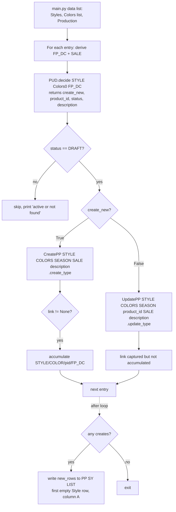
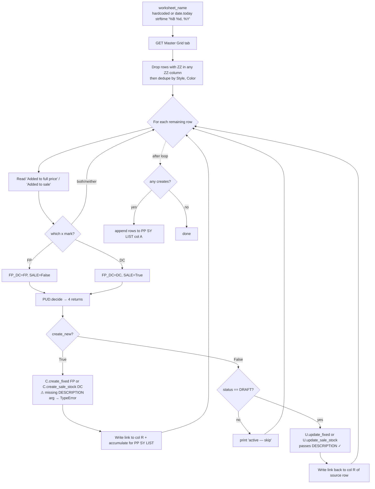

# PPA — Product Page Automation: Flow & Branch Summary

What the current pipeline does, end-to-end. Companion to [PPA_DATA_PREP.md](PPA_DATA_PREP.md) (inputs) and [README.md](README.md) (setup + quick reference).

The big insight: there are **two entry points** and **two operations** (create / update), but the per-production-type logic is consolidated into one `product_post()` helper in each of [create_pp.py](create_pp.py) and [update_pp.py](update_pp.py). The five production types share the same skeleton — they differ only in `ProductInfo` flags, inventory location, and (for `fixed` / `sale_stock`) stock-based filtering.

> **Both create and update run on the Shopify GraphQL `productSet` mutation** (`_run_product_set`), not REST `POST`/`PUT`. `productSet` attaches images by their existing **Files/Content GID**, so Shopify references the existing file instead of re-downloading it (no duplicate Content entries). It also lets create/update set options, variants, SEO, metafields (incl. the size chart), and images in a single synchronous call. Inventory and the per-variant Avalara taxcode metafield are posted separately via REST.

---

## 1. Two entry points

### 1.1 Manual run ([main.py](main.py))

Edit the `data` list (a list of `{Styles, Colors, Production}` dicts) at the top, run `python main.py`. `production(data)` loops every entry and handles **both create and update for all 5 types**.



### 1.2 Bulk sheet-driven run ([return_product.py](return_product.py))

Reads a daily worksheet from Master Grid of Return, iterates rows. Handles **both** create and update for `fixed` / `sale_stock`.



`return_product.py` creates **and** updates, but only for `fixed` / `sale_stock`. Placeholder types (`unfix`, `sample`, `o4`) are run from `main.py`.

> ⚠️ **`return_product.py`'s create branch is broken.** `C = create_pp.CreatePP(STYLE, COLORS, SEASON, SALE)` omits the required `DESCRIPTION` positional → `TypeError`, swallowed by the outer `try/except`. The update branch (`UpdatePP(..., DESCRIPTION)`) is correct. See [README §9](README.md#9-running).
>
> ⚠️ `worksheet_name` is currently hardcoded (`'Jun 5, 2026'`) with the `date.today()` line commented out.

---

## 2. The decision: create vs update ([post_update_decision.py](post_update_decision.py))

```python
def decide(STYLE, COLOR, FP_DC):
    # reads PP SY LIST tab of PPA sheet
    # 1) per-style description lookup (Color/FP_DC ignored — description is style-level)
    df_desc = df[df["Style"].str.contains(STYLE, case=False, na=False)]
    description = df_desc["Description"].iloc[-1] if not df_desc.empty else ""   # LAST matching row

    # 2) create vs update lookup (all three keys must match)
    df = df[
        df["Style"].str.contains(STYLE, case=False, na=False) &
        df["Color"].str.contains(COLOR, case=False, na=False) &
        (df["FP/DC"] == FP_DC)
    ]
    if df.empty:
        return True, "", "DRAFT", description       # not in sheet → treat as new
    return False, df['Product ID'].iloc[0], df['Page Status'].iloc[0], description
```

| `df.empty` | returned `create_new` | returned `product_id` | returned `status` | Caller behavior |
|---|---|---|---|---|
| True | `True` | `""` | `"DRAFT"` (forced) | run CreatePP |
| False, sheet DRAFT | `False` | `<int>` | `"DRAFT"` | run UpdatePP |
| False, sheet ACTIVE | `False` | `<int>` | `"ACTIVE"` | **skip** (don't overwrite live product) |

`description` is returned in all three cases (`""` if no style-matching row). It's injected into Shopify `descriptionHtml` as `<p>{description}</p>` between the sale-disclaimer block and the thread-composition paragraph, on both create and update. Note it takes the **last** (`.iloc[-1]`) matching style row.

The `"DRAFT"` forced-default means "no row in sheet" is treated identically to "row in sheet with DRAFT status" — both proceed to act on the product.

---

## 3. The five production types

| Type | `sample` | `sale` | `sas` | Sizes | Inventory location(s) | FP_DC | SALE |
|---|---|---|---|---|---|---|---|
| `unfix` | F | F | F | All 4 (template) | `Bali_To_Produce_ID` qty 5000 | FP | False |
| `fixed` | F | F | F | Only sizes with NE+Bali stock > 0 | `NE_First_Choice_ID` + `Bali_Stock_ID` real qty | FP | False |
| `sample` | T | T | F | S/M only | `NE_Sample_ID` qty from `get_sample_qty()` | DC | True |
| `sale_stock` | F | T | F | Only sizes with NE+Bali stock > 0 | `NE_First_Choice_ID` + `Bali_Stock_ID` real qty | DC | True |
| `o4` | F | T | T | All 4 (template) | `Bali_To_Produce_ID` qty 5000 | DC | True |

`fixed` and `sale_stock` are the only types that read live stock; the other three are placeholders.

---

## 4. Multi-color

Constructors take a **list of colors** (`COLORS`); `self.color = colors[0]`, `self.colors = colors`. `product_post` emits one variant per **(color × size)** and a single `Color` product option listing every colorway. Per-color images are matched from `Links storage` by an `alt` slug and attached via `"file": {"id": <Files GID>}`. SKU/barcode arrays are indexed `[i + j]` with `j = color_index * len(sizes)` (color-major).

Stock lookups (`get_NE_qty` / `get_BALI_qty` / `get_sample_qty`) still filter on the **first color only**, so for `fixed` / `sale_stock` treat one color per call as the safe path until stock becomes per-color.

---

## 5. The common pipeline

Every `create_*` / `update_*` method runs these conceptual steps in roughly the same order:

| # | Step | Where |
|---|------|-------|
| 1 | Construct `ProductInfo(STYLE, COLORS, SEASON, sample=, sale=, sas=)` | top of each method |
| 2 | *(fixed/sale_stock only)* `qty_ne, skus_ne = P.get_NE_qty()`; `qty_ba, skus_ba = P.get_BALI_qty()` | top of method |
| 3 | *(fixed/sale_stock only)* Build `keep` = indices where `qty_ne + qty_ba > 0`; skip product if `keep == []` | top of method |
| 4 | *(fixed/sale_stock only)* Build `skus_chosen` (NE primary, Bali fallback), `barcodes_chosen = P.fetch_barcode(skus_chosen)`, `total_qty` (scalar) | top of method |
| 5 | *(update only)* `GET 2024-01/products/{id}.json` → `existing` variants list | mid-method |
| 6 | `product_post(...)` builds the **ProductSetInput** (variants, options, tags, templateSuffix, SEO, metafields incl. size chart, files) and `ordered_skus` | shared helper |
| 7 | *(update only)* Stamp each desired variant with its existing `id` (by SKU, else by `(size,color)`); re-include preserved out-of-stock variants | in `product_post` |
| 8 | `_run_product_set(input, ordered_skus)` → `POST 2026-01/graphql.json productSet` → `(product_id, variants)` aligned to `ordered_skus` **by SKU** | shared helper |
| 9 | *(create only)* `set_sy.publish_to_all_channels(product_id, sale=...)` | after productSet |
| 10 | `set_inventory_metafield(variants, type, qty_ne=, qty_ba=, qty_sample=)` — per-variant `inventory_levels/set.json` + Avalara taxcode metafield | end of method |
| 11 | Return `(link, product_id)` (create) or `link` (update). Create failures → `(None, None)`. | end of method |

Images are part of the ProductSetInput (`files` + per-variant `"file": {"id": gid}`), so there is **no separate variant-image PUT step** — the old `_attach_variant_image` helper is gone.

---

## 6. Create flow ([create_pp.py](create_pp.py))

```
CreatePP(STYLE, COLORS, SEASON, SALE, DESCRIPTION).create_<type>()
   │
   ├── P = ProductInfo(STYLE, COLORS, SEASON, sample=, sale=, sas=)
   │
   ├── [fixed / sale_stock only]
   │     qty_ne, skus_ne = P.get_NE_qty()        ← reads NE STOCK
   │     qty_ba, skus_ba = P.get_BALI_qty()      ← reads BALI STOCK (X/L always 0)
   │     combined = qty_ne + qty_ba (per size, _to_int)
   │     keep = indices where combined > 0
   │     if not keep:  return (None, None)        ← skip product, no stock
   │     skus_chosen[i]  = skus_ne[i] if non-blank else skus_ba[i]
   │     barcodes_chosen = P.fetch_barcode(skus_chosen)    ← PRODUCTION UPC LIST lookup
   │     filter qty_ne / qty_ba by keep;  total_qty = sum(...)   ← scalar, feeds tag bands
   │
   ├── product_data, ordered_skus = self.product_post(P, keep=, qty=total_qty?, skus=skus_chosen?, barcodes=barcodes_chosen?)
   │     │
   │     ├── P.title_and_desc()         title, sale title, sale-disclaimer HTML, thread comp
   │     ├── P.get_SEL()                SEO page title, meta description, handle
   │     ├── P.get_metachart()          → (size-chart HTML, sizes)   [MASTER_DATA sheet]
   │     ├── P.get_weight()             per-size weight (grams) from IM Master xlsx
   │     ├── P.get_sku_barcode()        default barcodes + default SKUs (UPC LIST) — fallback only
   │     ├── [if keep]                  filter sizes/weights/default_skus/default_barcodes by keep
   │     ├── P.get_tags() + tg.additional_tags(tags, sizes, qty) → (tags, templateSuffix)
   │     ├── P.get_type()               productType from STYLE
   │     ├── P.get_price()              (full_price, price) cascading fallback
   │     ├── P.get_image_from_files()   per-color {id: <Files GID>, alt: <color-slug>}
   │     └── build ProductSetInput:
   │           handle, seo, title, descriptionHtml = sale_desc + <p>description</p> + thread_comp,
   │           vendor, productType, tags, status="DRAFT", templateSuffix,
   │           files (unique GIDs),
   │           metafields = [avalara.taxcode, custom.size_chart_metafield],   ← size chart is a metafield
   │           productOptions = [Size, Color],
   │           variants (one per color×size, each with "file": {id} + inventoryItem weight)
   │
   ├── product_id, variants = self._run_product_set(product_data, ordered_skus)
   │     POST 2026-01/graphql.json  productSet(synchronous: true)
   │     └── GraphQL errors / userErrors / null product → return (None, None)
   │     variants aligned to ordered_skus BY SKU → {id, inventory_item_id} or None
   │
   ├── set_sy.publish_to_all_channels(product_id, sale=...)
   │     ├── create_unfix / create_fixed → sale=False (Pinterest INCLUDED)
   │     └── create_sample / create_sale_stock / create_o4 → default sale=True (Pinterest EXCLUDED)
   │
   ├── set_inventory_metafield(variants, type, qty_ne=, qty_ba=, qty_sample=)
   │     │
   │     ├── fixed / sale_stock → inventory_levels/set NE_First_Choice_ID=qty_ne[i], Bali_Stock_ID=qty_ba[i]
   │     ├── sample             → inventory_levels/set NE_Sample_ID=qty_sample
   │     ├── unfix / o4         → inventory_levels/set Bali_To_Produce_ID=5000
   │     └── per-variant POST avalara.taxcode metafield   (skips any None variant)
```

`create_*` is wrapped in `try / except Exception: traceback.print_exc(); return (None, None)`. All failure paths return `(None, None)`.

---

## 7. Update flow ([update_pp.py](update_pp.py))

Mirrors create, except the product already exists; we GET its variants, then productSet with the merged variant set.

```
UpdatePP(STYLE, COLORS, SEASON, PRODUCT_ID, SALE, DESCRIPTION).update_<type>()
   │
   ├── P = ProductInfo(...)
   │
   ├── [fixed / sale_stock only]   same stock filter + skus_chosen + barcodes_chosen as create
   │
   ├── existing = GET 2024-01/products/{PRODUCT_ID}.json → ["product"]["variants"]   (REST, 2024-01)
   │
   ├── product_set_input, ordered_skus = self.product_post(self.COLORS, P, existing, keep=, qty=, skus=, barcodes=)
   │     ├── build sku_to_gid + options_to_gid from existing variants
   │     ├── for each desired (color×size) variant: stamp id = sku_to_gid[sku] or options_to_gid[(size,color)]
   │     ├── PRESERVE every existing variant NOT in the desired set (re-include it) so productSet
   │     │     (full-sync on the variants list) does NOT delete out-of-stock sizes
   │     ├── productOptions list every Size/Color value across desired + preserved
   │     ├── files attached ONLY when non-empty (an empty list would delete ALL media)
   │     └── input includes: id, handle, seo, descriptionHtml, tags, templateSuffix,
   │           metafields [avalara.taxcode, custom.size_chart_metafield], productOptions, variants
   │         input OMITS: title, status  → DRAFT stays DRAFT with its existing title
   │
   ├── product_id, variants = self._run_product_set(product_set_input, ordered_skus)
   │     POST 2026-01/graphql.json  productSet(synchronous: true)
   │
   └── set_inventory_metafield(variants, type, qty_ne=, qty_ba=, qty_sample=)
         — UNLIKE create: posts to ALL FOUR locations per variant, zeroing
           the locations irrelevant to the type. Wipes stale stock from a previous type.
```

### `productSet` reconciliation semantics

- Variant **with** `id` → update in place.
- Variant **without** `id` → create.
- Existing variant **omitted** from the list → deleted. **This is why update re-includes the out-of-stock variants** (`preserved`) — so they survive instead of being dropped.

`handle`, `seo`, `descriptionHtml`, `tags`, `templateSuffix`, the metafields (incl. size chart), and `files` **are** in the update payload, so URL/SEO, description, tags, template, size chart, and images all refresh on every update. `title` and `status` are **not**, so a DRAFT stays DRAFT.

### `set_inventory_metafield` divergence (create vs update)

| Type | Create-side posts to | Update-side posts to |
|---|---|---|
| `fixed`, `sale_stock` | `NE_First_Choice_ID`, `Bali_Stock_ID` | All 4 — real qty to NE+Bali, `0` to NE_Sample + Bali_To_Produce |
| `sample` | `NE_Sample_ID` | All 4 — `qty_sample` to NE_Sample, `0` to the other 3 |
| `unfix` / `o4` (default branch) | `Bali_To_Produce_ID` | All 4 — `5000` to Bali_To_Produce, `0` to the other 3 |

Practical effect: changing a product's type via update (e.g. promoting `unfix` → `fixed`) cleanly resets stock at the now-irrelevant locations. Create doesn't need this because there's nothing to reset.

---

## 8. Inventory & SKU/barcode sourcing

| Type | SKU source | Barcode source | Why |
|---|---|---|---|
| `unfix`, `sample`, `o4` | `PRODUCTION UPC LIST` / `SAMPLE UPC LIST` via `P.get_sku_barcode()` | Same (positional pairing) | Placeholder products — use the canonical UPC list |
| `fixed`, `sale_stock` | NE STOCK (primary), Bali STOCK (fallback) per size | `PRODUCTION UPC LIST` looked up **by SKU** via `P.fetch_barcode(skus_chosen)` | Real-stock products — SKU must reflect what's shippable; barcode joined by value, not position |

`fetch_barcode` returns `""` for unknown SKUs and Shopify accepts empty strings. If both `skus_ne[i]` and `skus_ba[i]` are blank for a size with `qty > 0`, the variant ends up with `sku=""` and `barcode=""` — a data-entry symptom worth investigating.

**Inventory mapping is by SKU**, not position: `_run_product_set` returns the productSet variants keyed by their `sku` and aligned to `ordered_skus`. A variant whose SKU wasn't returned comes back `None` and is skipped (with a console note) rather than mis-assigning qty.

---

## 9. Key derived fields

- **Sizes**: `X/S`, `S/M`, `M/L`, `X/L`. `SIZE_RANGE` maps each to a body-size label (`S/M → (6-8)`) used in the `Size` option text (`"S/M (6-8)"`).
- **Size chart**: rendered HTML from `MASTER_DATA_ID`, written as the **`custom.size_chart_metafield`** product metafield (not embedded in body). Shows all master-data sizes regardless of stock filtering. `DEV | XL | (Y/N)` toggles X/L.
- **Description**: `PUD.decide()` pulls the `Description` column of `PP SY LIST` (**last** row where `Style` substring-matches). Injected into `descriptionHtml` as `<p>{description}</p>`. Edit the cell + re-run an update to refresh it.
- **Generic color**: looked up in `Color list`; if absent, GPT proposes one and writes it back (a side-effect during create or update).
- **Price**: `P.get_price()` returns `(full_price, price)` with cascading fallback `PB ADJUSTED …` → `LATEST …` → `IM PRICE`. Empty → `_money()` coerces to `None` and the field is omitted from the variant.
- **Images**: `get_image_from_files()` reads the `ID` column (Files/Content GID) from `Links storage`, sorted by `Filename`, grouped per color. Attached by GID reference — no Content duplicates, no re-download on update.
- **Template suffix**: `tg.additional_tags` returns one based on qty bands; if `None`, fallback is `'sale-item'` when `self.sale=True` else `'default'`.
- **Tags**: base tags from `P.get_tags()` plus appendage from `tg.additional_tags` (qty/size-driven), split into a list for the productSet `tags` field.
- **Status**: created `DRAFT`. Updates omit `status`, so it's untouched.

---

## 10. Error handling & idempotency

- All `create_*` / `update_*` methods are wrapped in `try / except Exception: traceback.print_exc()`. They never raise; create returns `(None, None)` on failure, update returns a built `link` regardless (so a non-None update return ≠ success).
- `main.py` checks `if link is not None:` before accumulating for the PP SY LIST writeback; `return_product.py` checks `if link:` in its create branch before writing.
- **No idempotency on create**: a failed mid-create (productSet succeeded but inventory POST failed) leaves a Shopify draft with wrong/zero inventory. Re-running `decide` with no PP SY LIST row would create a duplicate. The PP SY LIST writeback happens after all sub-calls, so a missing row signals an incomplete create.
- **`_run_product_set` checks `userErrors` and `errors`** and returns `(None, None)` on either, so create won't proceed to inventory with a failed product. (Update's `update_*` still builds a `link` even on failure.)
- **`set_inventory_metafield` skips `None` variants** (a SKU productSet didn't return), printing a note rather than raising.

---

## 11. Files involved

| File | Role |
|---|---|
| [main.py](main.py) | Manual entry — `data` list of dicts, looped by `production()`; all 5 types, create + update |
| [return_product.py](return_product.py) | Bulk entry from Master Grid of Return — creates and updates `fixed` / `sale_stock` only |
| [post_update_decision.py](post_update_decision.py) | `decide()` — PP SY LIST lookup for create-vs-update routing + per-style description (`.iloc[-1]`) |
| [create_pp.py](create_pp.py) | `CreatePP` — 5 `create_*`, `product_post`, `_run_product_set`, `set_inventory_metafield` |
| [update_pp.py](update_pp.py) | `UpdatePP` — 5 `update_*`, `product_post` (with variant preservation), `_run_product_set`, `set_inventory_metafield` |
| [fetch_to_product_page.py](fetch_to_product_page.py) | `ProductInfo` — all data fetching/derivation (stock, SKU, barcode, weight, price, SEO, tags, size chart, images) |
| [Setup/fetch_product_id_new.py](Setup/fetch_product_id_new.py) | Snapshot existing Shopify products into PP SY LIST (run daily) |
| [Setup/fetch_images_name_link.py](Setup/fetch_images_name_link.py) | List Shopify Files into `Links storage` (ID + URL + Filename) |
| [Setup/set_sy.py](Setup/set_sy.py) | Shopify auth headers, `publish_to_all_channels`, `product_url` |
| [Setup/setup.py](Setup/setup.py) | Google Sheets client + cached `_get_sheet_values`, Shopify `HEADERS`, `sheet` |
| [Setup/tags_generator.py](Setup/tags_generator.py) | `generate_tags` (base) and `additional_tags(tags, sizes, qty)` → `(tags, templateSuffix)` |
| [Setup/generic_color_generator.py](Setup/generic_color_generator.py) | Brand color → generic color (GPT fallback writes back to sheet) |
| [config/varia.py](config/varia.py) | Constants (`IM_header`, default `season`) |

---

## 12. Known gaps / open items

1. **`return_product.py` create branch is broken.** `CreatePP(STYLE, COLORS, SEASON, SALE)` omits the required `DESCRIPTION` arg → `TypeError`, masked by the outer `try/except`. The update branch is correct. Add `DESCRIPTION`.
2. **Multi-color stock is first-color-only.** `get_NE_qty` / `get_BALI_qty` / `get_sample_qty` filter on `colors[0]`; additional colors reuse that keep/qty. Safe for placeholder types; risky for `fixed`/`sale_stock`.
3. **`set_inventory_metafield` divergence between create and update.** Create posts only to relevant locations; update posts to all 4 (zeroing irrelevant). Intentional reset semantic, but the helpers aren't interchangeable.
4. **Metafield POST may create duplicates.** `POST /metafields.json` runs on every update; Shopify usually dedupes by `(owner_id, namespace, key)` but it's not guaranteed for all types. Consider GraphQL `metafieldsSet` if duplicates appear.
5. **API version mismatch.** `update_pp.py` uses `2024-01` for the product GET and `2026-01` for productSet + inventory + metafields. `create_pp.py` is `2026-01` throughout.
6. **`keep` doesn't filter on blank SKU.** A size with `qty > 0` and both `skus_ne[i]`/`skus_ba[i]` blank creates a variant with empty SKU/barcode.
7. **`PP SY LIST` Page Status is a stale snapshot** — only refreshed by `fetch_product_id_new.py`. A product can drift DRAFT → ACTIVE between snapshots.
8. **`PUD.decide` uses substring regex matching** — prefix-colliding styles can grab the wrong row. Description uses `.iloc[-1]`, so the *last* matching style row wins.
9. **`return_product.py` only handles `fixed` / `sale_stock`.** Placeholder types are `main.py`-only.
10. **Hardcoded columns / sheet IDs.** `return_product.py` link → column R; both writebacks → column A with the PPA sheet ID as a string literal (not `.env`).
11. **Update overwrites `handle`/`seo`/`descriptionHtml`/`tags`/`templateSuffix`/size-chart/images.** Hand edits in the Shopify admin get clobbered on the next update. Edit the source sheets.
12. **`files=[]` would delete all media on update** — guarded by attaching `files` only when non-empty.

Items 1, 2, 6, 8 are the most likely to bite; the rest are mostly informational.
